# Yeelight Cube Lite for Home Assistant

[](https://github.com/hacs/integration)
[](https://buymeacoffee.com/max.src)

A Home Assistant custom integration for the **Yeelight Cube Smart Lamp Lite**. This lamp features a **20×5 RGB LED matrix** (100 individually addressable pixels). This integration gives you full pixel-level control from your HA dashboard: draw pixel art, display scrolling text, apply gradients, color effects, transitions, and more.


---

## Table of Contents

- [Features](#features)
  - [Light Integration](#light-integration)
  - [Customizable Lovelace Cards](#customizable-lovelace-cards)
- [Installation via HACS](#installation-via-hacs)
  - [Add as Custom Repository](#add-as-custom-repository)
  - [Manual Installation](#manual-installation)
- [Setup](#setup)
  - [Prerequisites: Yeelight Station App](#prerequisites-yeelight-station-app)
  - [Adding to Home Assistant](#adding-to-home-assistant)
- [Lovelace Cards](#lovelace-cards)
  - [Preview Card](#yeelight-preview-card-customyeelight-cube-lamp-preview-card)
  - [Colors Card](#yeelight-colors-card-customyeelight-cube-color-list-editor-card)
  - [Palettes Card](#yeelight-palettes-card-customyeelight-cube-palette-card)
  - [Gradient Card](#yeelight-gradient-card-customyeelight-cube-gradient-card)
  - [Draw Card](#yeelight-draw-card-customyeelight-cube-draw-card)
- [Entities Created](#entities-created)
- [Automations & Node-RED](#automations--node-red)
  - [Calling Custom Actions](#calling-custom-actions)
  - [Key Actions Reference](#key-actions-reference)
- [Display Modes](#display-modes)
- [Transition Effects](#transition-effects)
- [Requirements](#requirements)
- [Troubleshooting](#troubleshooting)
- [License](#license)
- [Support](#support)

---

## Features

### Light Integration

- **Full 20×5 RGB matrix control**: individual pixel-level color
- **Brightness control**
- **Colors & gradient support**
- **Color adjustment/effects**
- **Transition effects**
- **Multi-lamp support**
- **Auto-discovery**
- **Local-only**: all communication stays on your LAN, no cloud dependency

### Customizable Lovelace Cards

- **Preview Card**: live lamp preview with brightness and color adjustments
- **Colors Card**: edit colors used to display text and apply gradients on your lamps
- **Palettes Card**: manage lists of colors (palettes)
- **Gradient Card**: configure and preview gradient & color modes applied on your lamps
- **Draw Card**: draw on your lamps and manage drawings (pixel arts)

- **Light & dark theme support**: all cards adapt to your Home Assistant theme, including light and dark modes

---

## Installation via HACS

### Add as Custom Repository

1. Open **HACS** in your Home Assistant dashboard
2. Click the **⋮** menu (top right) → **Custom repositories**

<!-- TODO: screenshot: HACS main page with the ⋮ menu open -->

3. Add this URL and set the category to **Integration**, then click **Add**:
   ```
   https://github.com/Max-src/yeelight-cube-lite
   ```

<!-- TODO: screenshot: Custom repositories dialog with URL filled in -->

4. The repository now appears in the custom repositories list. Close the dialog.
5. Back in HACS, search for **Yeelight Cube Lite** and open the result

<!-- TODO: screenshot: HACS search results showing Yeelight Cube Lite -->

6. Click **Download** (or **Install**) and confirm

<!-- TODO: screenshot: HACS integration detail page with Download button -->

7. **Restart Home Assistant**

### Manual Installation

1. Download the [latest release](https://github.com/Max-src/yeelight-cube-lite/releases)
2. Copy the contents into `custom_components/yeelight_cube/` inside your HA config directory
3. Restart Home Assistant

---

## Setup

### Prerequisites: Yeelight Station App

Before adding the lamp to Home Assistant, you must first set it up using the **Yeelight Station app** (not the standard Yeelight app). This is where you configure Wi-Fi access and enable LAN control.

1. **Download the Yeelight Station app** from the App Store (iOS) or Google Play (Android)
2. **Power on the lamp**
3. **Add the lamp to the app**: follow the in-app instructions to connect the lamp to your **2.4 GHz Wi-Fi network**
4. **Enable LAN Control**: in the app, go to your lamp's **Device Settings** and activate **LAN Control**. This is required for the Home Assistant integration to communicate with the lamp over your local network
5. **Find the lamp's IP address**: still in the Device Settings screen, go to **Device info** to find the IP address assigned to the lamp on your network (e.g. `192.168.4.139`).

<table>
  <tr>
    <td>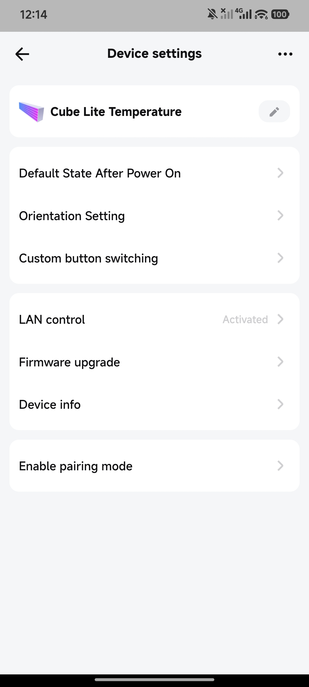</td>
    <td>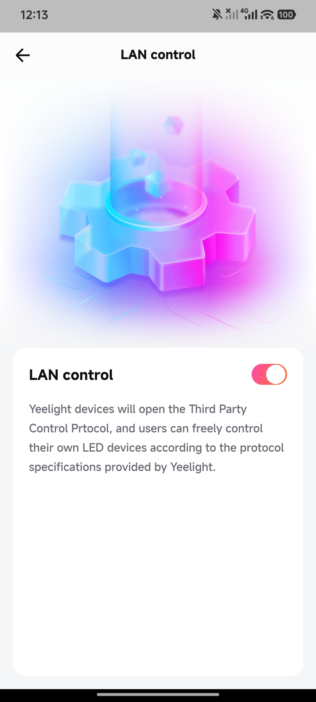</td>
    <td>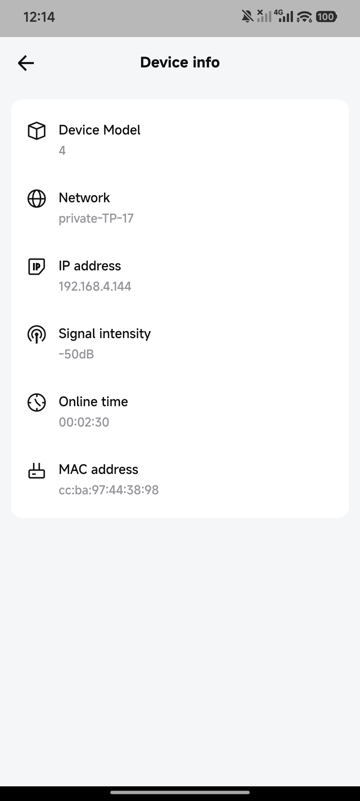</td>
  </tr>
</table>

<!-- TODO: Add screenshot of Yeelight Station app: Device Settings showing LAN Control toggle and IP address -->

> **Tip:** You can also find the lamp's IP address from your router's admin page or DHCP client list. Assigning a static IP / DHCP reservation for the lamp is recommended to prevent the address from changing.

### Adding to Home Assistant

#### Automatic Discovery (recommended)

Once the lamp is on your network with LAN Control enabled, Home Assistant will **automatically detect it** via Zeroconf (mDNS), **no IP address is needed**. You'll see a notification on the **Settings → Devices & Services** page:

1. Look for the **Yeelight Cube Lite** discovery notification

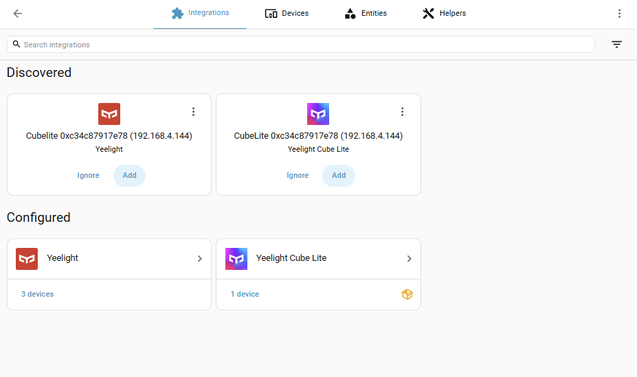

2. Click **Add**

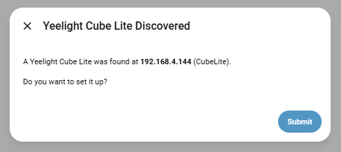

3. Confirm to set up the device

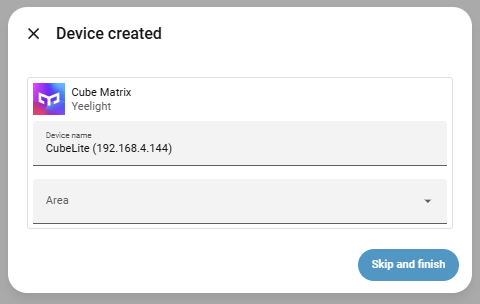

4. Done. The integration creates all entities automatically.

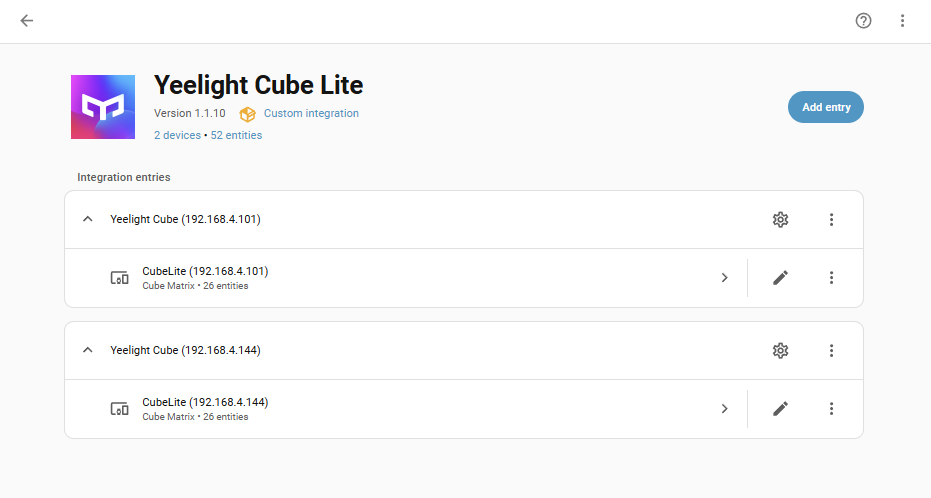

> **Note:** If you also use the official Yeelight integration, it may also generate a discovery notification for the same lamp. That notification is **automatically suppressed** by this integration: you can safely ignore it. The lamp will not work correctly if added via the built-in Yeelight integration.

> **IP address changes:** The integration uses auto-rediscovery. If the lamp gets a new IP address (e.g. after a router reboot), the integration finds it again automatically, no manual intervention required.

#### Manual Setup (alternative)

If the lamp is not discovered automatically (e.g. it's on a different subnet or mDNS is blocked), you can add it manually:

1. Go to **Settings → Devices & Services**
2. Click **+ Add Integration** (bottom right)
3. Search for **Yeelight Cube Lite** and select it
4. On this integration detail page, click on the button **Add entry**

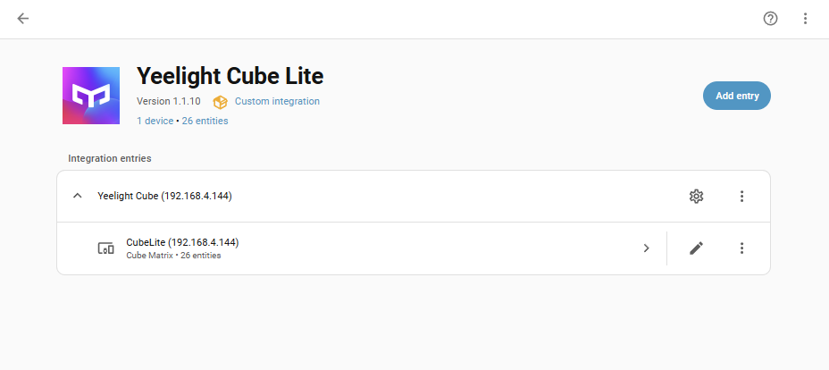

5. Enter the **IP address** you noted from the Yeelight Station app (e.g. `192.168.4.139`)

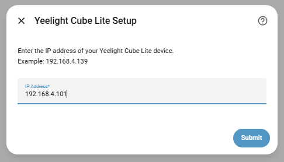

6. Click **Submit**. Your light has been added to the list of integration entries.


<!-- TODO: Add screenshot of the Add Integration search showing Yeelight Cube Lite -->
<!-- TODO: Add screenshot of the IP address entry form -->

The integration will connect to the lamp over your local network and automatically create a device with all entities: light control, display mode selectors, color effect sliders, text input, transition settings, sensors, camera previews, and more (see [Entities Created](#entities-created) for the full list).

<!-- TODO: Add screenshot of the device page after successful setup -->

> **Note:** Each lamp (base unit) needs to be added separately. If you have multiple lamps, repeat the process for each one.

---

## Lovelace Cards

This component includes custom lovelace cards you can use on your dashboards.

Every card comes with a **visual configuration editor**: click the pencil icon in the dashboard editor to customize any card visually without the need to use YAML. Each section of a card (colors, tools, gallery, buttons, matrix preview, etc.) can be configured from the editor. Most sections offer **multiple display styles and layout modes**, so you can tweak of every card to fit your dashboard.

All cards **support light and dark themes**. Colors, borders, backgrounds and text automatically adapt to your current Home Assistant theme.

> After installing or updating, do a hard refresh (`Ctrl+F5`) in your browser if the yeelight cards don't appear.

<table>
  <tr>
    <td>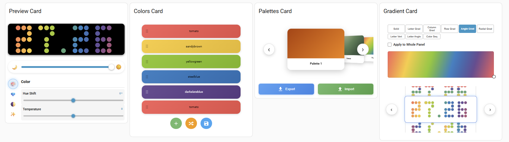</td>
    <td>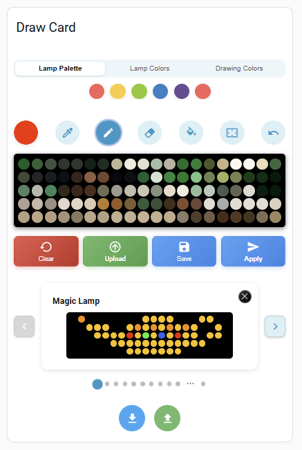</td>
  </tr>
</table>

### Yeelight Preview Card: `custom:yeelight-cube-lamp-preview-card`

A live dashboard card that mirrors the lamp's current state and provides quick controls. The matrix preview updates in real time as colors and effects change. A brightness slider is available, as well as power & refresh actions. A color adjustments panel gives access to effects. The card adapts to both light and dark Home Assistant themes.

These are all different configurations for the preview card:

<table>
  <tr>
    <td>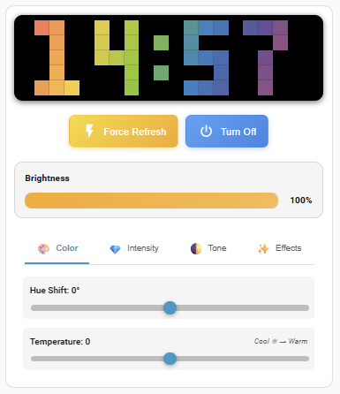</td>
    <td>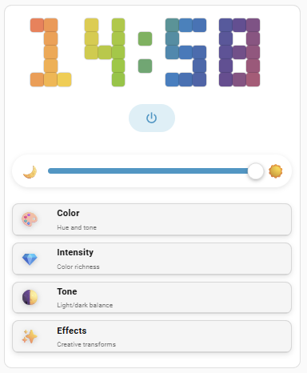</td>
    <td>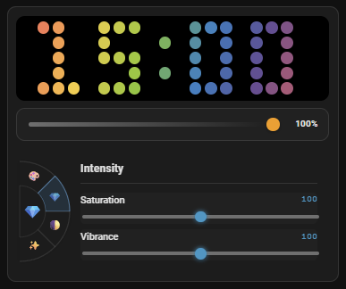</td>
    <td>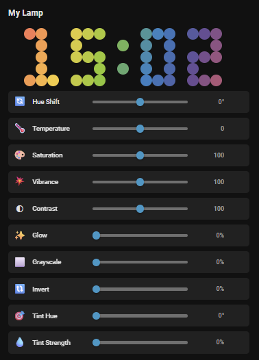</td>
    <td>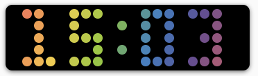
    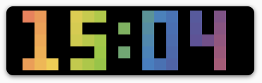</td>
  </tr>
</table>

**Features:**

- **Lamp preview**: reflects what actually displayed on the lamp. Configurable pixel style (square/rounded/circle), space between pixels, background color, box shadow, and size
- **Refresh & power actions**: quick buttons to force refresh (reconnect) if the lamp is not responding, or turn off/on the lamp.
- **Brightness slider**: a brightness slider with configurable styles
- **Color adjustments**: different color effect sliders. Different layout modes are available, optional change indicators and configurable reset buttons.

Different config sections of the editor card:

<table>
  <tr>
    <td>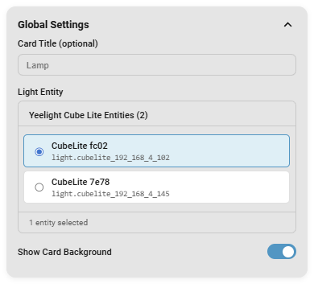</td>
    <td>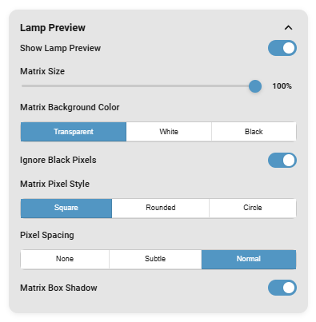</td>
    <td>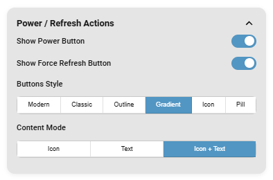</td>
    <td>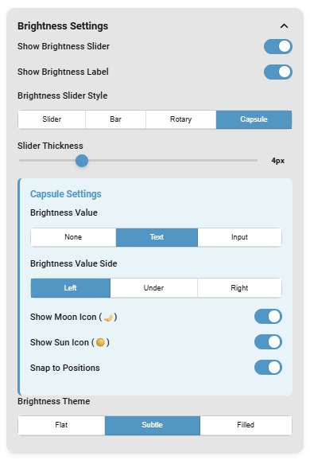</td>
    <td>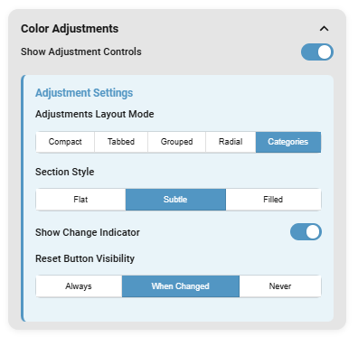</td>
  </tr>
</table>

### Yeelight Colors Card: `custom:yeelight-cube-color-list-editor-card`

A card for editing the ordered list of colors used by the text displayed on the lamp. Colors can be added, deleted, dragged to reorder, shuffled, and saved as a reuseable palette (list of colors).

These are all different configurations for the colors card:

<table>
  <tr>
    <td>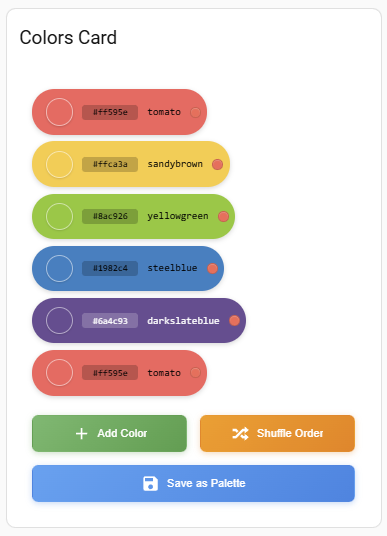</td>
    <td>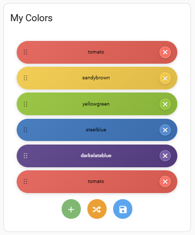</td>
    <td>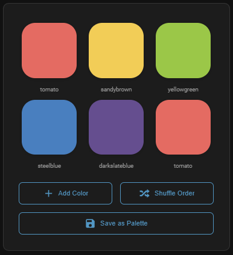</td>
    <td>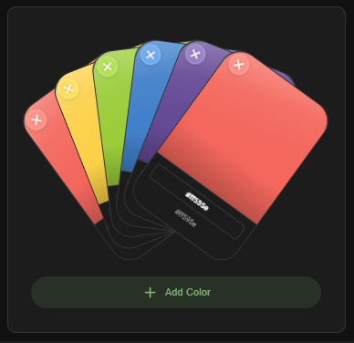</td>
    <td>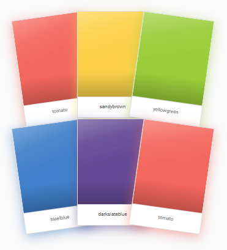</td>
  </tr>
</table>

**Features:**

- **Multiple-entity support**: this card allows to control multiple Yeelight Cube Lite lamps at the same time.
- **Color list**: add, remove, and reorder colors with drag-and-drop. Different layout modes available. Display color hex code or color name if needed.
- **Color edit**: use a color picker or hex input to edit colors.
- **Add / Shuffle / Save actions**: buttons to add a color to the list, shuffle the colors in the list, and save the list as a reuseable palette (list of colors).

Different config sections of the editor card:

<table>
  <tr>
    <td>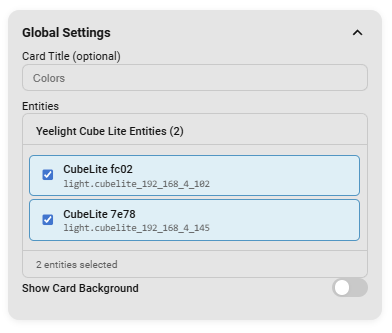</td>
    <td>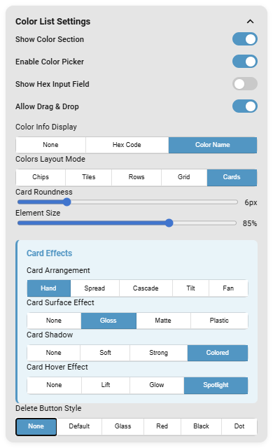</td>
    <td>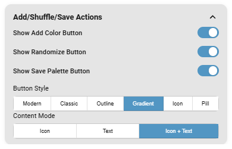</td>
  </tr>
</table>

### Yeelight Palettes Card: `custom:yeelight-cube-palette-card`

A card for managing color palettes (lists of colors). Palettes can be applied to the lamps instantly. Selecting a color palette will apply its colors to the lamps, the colors card, the gradient card and the preview card. Multiple display modes are supported.

These are all different configurations for the palettes card:

<table>
  <tr>
    <td>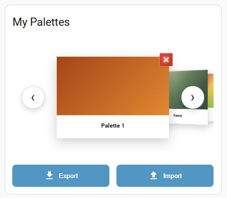</td>
    <td>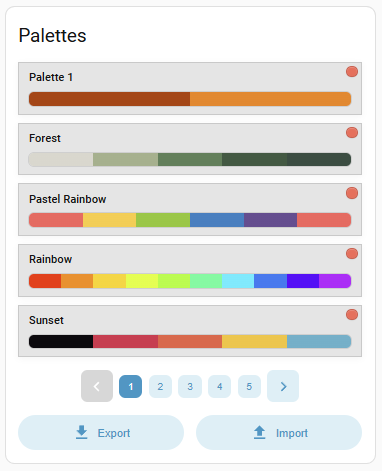</td>
    <td>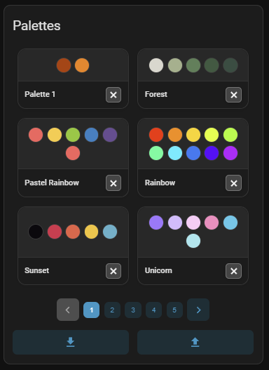</td>
    <td>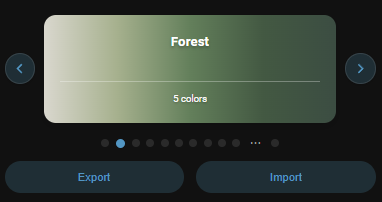
    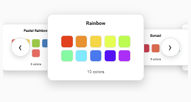</td>
  </tr>
</table>

**Features:**

- **Multiple-entity support**: this card allows to control multiple Yeelight Cube Lite lamps at the same time.
- **Manage palettes**: browse palettes using different display modes and configurable color swatch styles. Load the whole palette's colors onto the lamp with one click. Rename and delete palettes if needed.
- **Import/Export**: load and save full palettes collections.

Different config sections of the editor card:

<table>
  <tr>
    <td>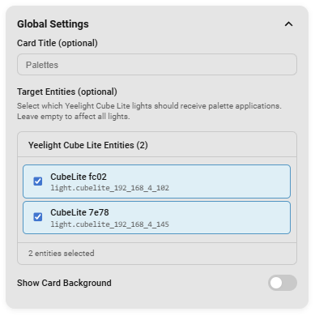</td>
    <td>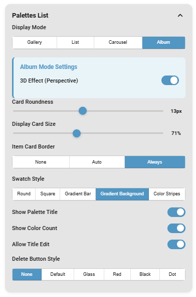</td>
    <td>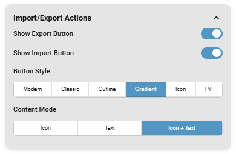</td>
  </tr>
</table>

### Yeelight Gradient Card: `custom:yeelight-cube-gradient-card`

A card for selecting and configuring the lamp's gradient and color modes. Different mode selectors allow you to switch between the available gradient modes. An angle control let's you adjust the gradient direction. Preview for all gradient modes is possible.

These are all different configurations for the gradient card:

<table>
  <tr>
    <td>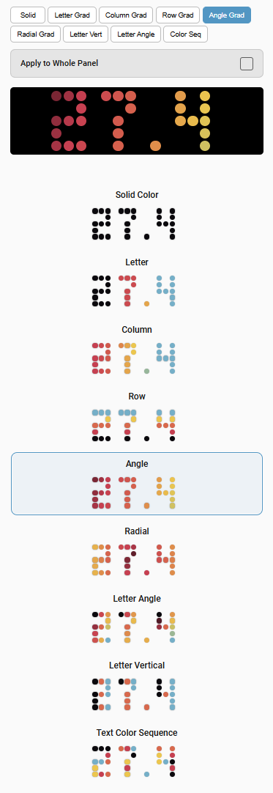</td>
    <td>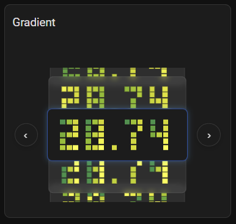</td>
    <td>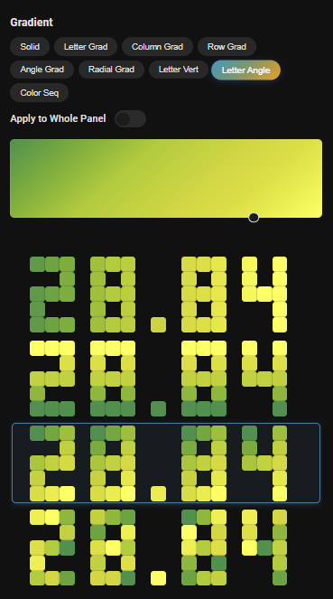</td>
    <td>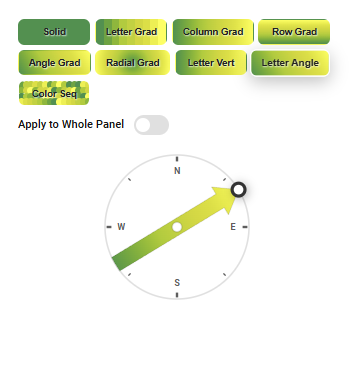</td>
    <td>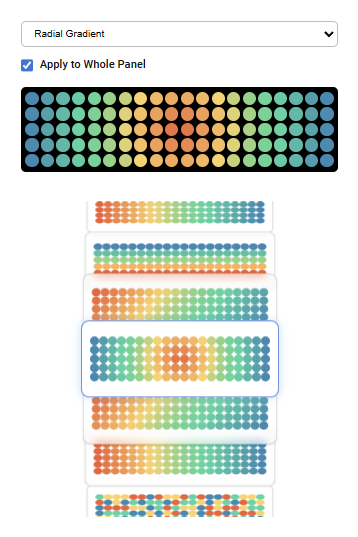</td>
  </tr>
</table>
<!-- TODO: screenshots: Gradient Card variations (mode selector styles, angle selector styles, gradient preview) -->

**Features:**

- **Multiple-entity support**: this card allows to control multiple Yeelight Cube Lite lamps at the same time.
- **Color mode selector**: switch between gradient/color modes. You can also apply the gradient/color mode to the whole panel (ignore text and pixel art).
- **Angle selector**: real-time adjustment of the gradient angle using a slider, number input, or rotary control. Multiple rotary styles available.
- **Gradient preview**: a mini matrix preview of how the gradient modes will look on the lamps with the current text, colors and gradient angle. The previews can be used to switch between gradient modes. The list can be refined by hiding gradient modes.

Different config sections of the editor card:

<table>
  <tr>
    <td>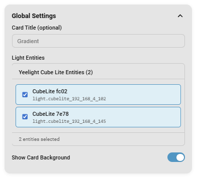</td>
    <td>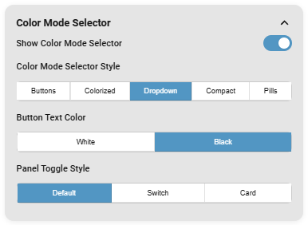</td>
    <td>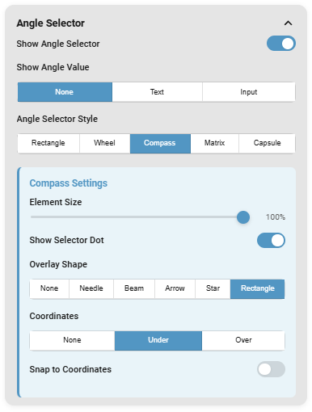</td>
    <td>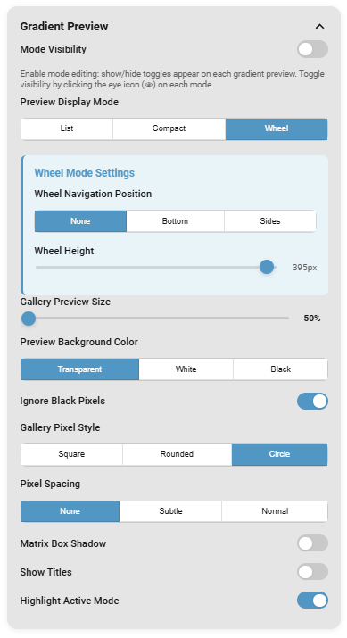</td>
  </tr>
</table>
<!-- TODO: screenshots: Gradient Card editor sections (Global Settings, Color Mode Selector, Angle Selector, Gradient Preview) -->

### Yeelight Draw Card: `custom:yeelight-cube-draw-card`

The pixel art editor. Paint on a 20×5 interactive matrix, save designs to a personal gallery, and push artwork to one or more lamps with a single tap. Each section of the card (colors, drawing tools, matrix, action buttons, gallery) can be shown or hidden and configured independently.

These are all different configurations for the draw card:

<table>
  <tr>
    <td>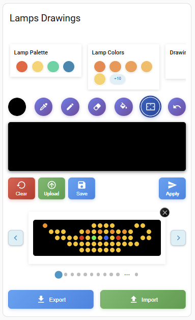</td>
    <td>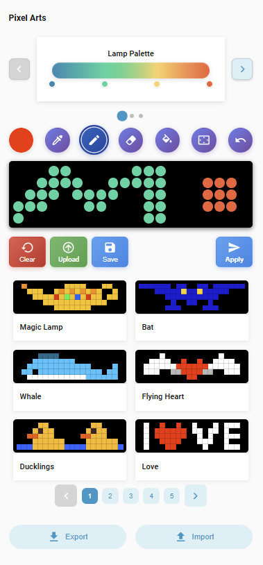</td>
    <td>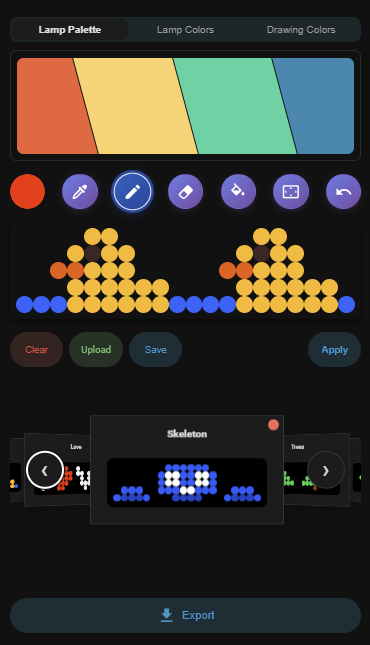</td>
    <td></td>
  </tr>
</table>
<!-- TODO: screenshots: Draw Card variations (full view, gallery modes, palette layout modes) -->

**Features:**

- **Multiple-entity support**: this card allows to control multiple Yeelight Cube Lite lamps at the same time.
- **Colors section**: this section gives quick access to recent colors, lamp palette colors, current lamp colors and drawing colors. Different container modes and swatches display modes are available.
- **Drawing tools**: a row of drawing tools that can be individually shown or hidden with different styles too.
- **Drawing matrix**: an interactive matrix area to draw on your lamps.
- **Action buttons**: quick action buttons to apply drawing to the lamps, upload drawing from an image file, save your drawing in the list of pixel arts or clear the drawing area.
- **Pixel art gallery**: manage your list of pixel arts and apply them on your lamps.
- **Import/Export**: import and export pixel art collections as JSON files.

Different config sections of the editor card:

<table>
  <tr>
    <td></td>
    <td></td>
    <td></td>
    <td></td>
    <td></td>
    <td></td>
    <td></td>
    <td></td>
  </tr>
</table>
<!-- TODO: screenshots: Draw Card editor sections (Global Settings, Layout, Colors Section, Drawing Tools, Drawing Matrix Section, Action Buttons, Pixel Art Section, Import/Export Actions) -->

---

## Entities Created

Each Yeelight Cube Lite lamp creates its own set of per-device entities, all grouped under the same device in Home Assistant. In addition, the integration creates a set of **global entities** (Color Palettes, Saved Drawings, Font Characters) that are shared across all lamps and exist at the integration level. They are not tied to any individual lamp.

### Per-device entities

The following entities are created for each lamp and visible on its device page.

Overview of entities available for each lamp:

<table>
  <tr>
    <td></td>
    <td></td>
    <td></td>
    <td></td>
  </tr>
</table>

#### Controls

These entities appear in the **Controls** section of the device page and can be used in dashboards, automations, and scripts.

<table>
  <tr>
    <td></td>
  </tr>
</table>

| Entity                 | Type            | Description                                                                                                                                                                                                           |
| ---------------------- | --------------- | --------------------------------------------------------------------------------------------------------------------------------------------------------------------------------------------------------------------- |
| **Auto Turn On**       | Switch          | Automatically turn on the lamp when a new mode or drawing is applied                                                                                                                                                  |
| **Yeelight Cube Lite** | Light           | Main light entity (on/off, RGB color, brightness)                                                                                                                                                                     |
| **Display Mode**       | Select          | Switch between: Solid Color, Letter Gradient, Column Gradient, Row Gradient, Angle Gradient, Radial Gradient, Letter Vertical Gradient, Letter Angle Gradient, Text Color Sequence, Panel Color Sequence, Custom Draw |
| **Display Text**       | Text            | Text input for custom text display on the matrix (supports scrolling)                                                                                                                                                 |
| **Flip Orientation**   | Switch          | Flip the matrix display horizontally (for mounting the lamp upside-down)                                                                                                                                              |
| **Font**               | Select          | Choose between 3 included text fonts (basic, fat, italic)                                                                                                                                                             |
| **Gradient Angle**     | Number (slider) | Angle for angle-based gradient modes (0°–360°)                                                                                                                                                                        |
| **Palette**            | Select          | Select from saved color palettes to apply to the lamp                                                                                                                                                                 |
| **Pixel Art**          | Select          | Select from saved pixel arts (drawings) to load on the lamp                                                                                                                                                           |
| **Text Alignment**     | Select          | Text alignment on the lamp (left, center, right)                                                                                                                                                                      |

#### Sensors

These entities appear in the **Sensors** section of the device page. Use these "fake camera" entities to add a quick preview on your dashboard with a "Picture Entity" card. For more responsive and more configurable previews you can use the custom [Preview Card](#yeelight-preview-card-customyeelight-cube-lamp-preview-card)

<table>
  <tr>
    <td></td>
  </tr>
</table>

| Entity                      | Type   | Description                                                     |
| --------------------------- | ------ | --------------------------------------------------------------- |
| **Matrix Preview (Round)**  | Camera | Live camera feed of the lamp state, rendered with round pixels  |
| **Matrix Preview (Square)** | Camera | Live camera feed of the lamp state, rendered with square pixels |

#### Configuration

These entities appear in the **Configuration** section of the device page. They control color adjustments and animated transitions effects.

<table>
  <tr>
    <td></td>
  </tr>
</table>

| Entity                     | Type            | Description                                                       |
| -------------------------- | --------------- | ----------------------------------------------------------------- |
| **Color: Hue Shift**       | Number (slider) | Shift all colors around the color wheel (−180° to +180°)          |
| **Color: Temperature**     | Number (slider) | Warm/cool color temperature adjustment (−100 to +100)             |
| **Effects: Grayscale**     | Number (slider) | Grayscale intensity (0–100%)                                      |
| **Effects: Invert**        | Number (slider) | Color inversion intensity (0–100%)                                |
| **Effects: Tint Hue**      | Number (slider) | Tint color hue (0°–360°)                                          |
| **Effects: Tint Strength** | Number (slider) | Tint overlay intensity (0–100%)                                   |
| **Intensity: Saturation**  | Number (slider) | Color saturation level (0–200%)                                   |
| **Intensity: Vibrance**    | Number (slider) | Vibrance / adaptive saturation (0–200%)                           |
| **Tone: Contrast**         | Number (slider) | Contrast level (0–200%)                                           |
| **Tone: Glow**             | Number (slider) | Bloom / glow effect strength (0–100%)                             |
| **Transition Duration**    | Number (slider) | Total transition time in seconds (0.2–10s)                        |
| **Transition Effect**      | Select          | Choose from 24 transition animations when switching display modes |
| **Transition Steps**       | Number (slider) | Number of animation steps for transitions (1–10)                  |

#### Diagnostic

These entities appear in the **Diagnostic** section of the device page.

<table>
  <tr>
    <td></td>
  </tr>
</table>

| Entity            | Type   | Description                                                |
| ----------------- | ------ | ---------------------------------------------------------- |
| **Force Refresh** | Button | Recover a stuck lamp by re-activating connection           |
| **IP Address**    | Sensor | Current IP address of the lamp (updated after rediscovery) |

### Global entities

These three sensor entities are created **once per integration install**. They are shared across all lamps (not tied to a specific device). They store and expose the palettes, pixel art, and font maps that the devices and cards can read.

<table>
  <tr>
    <td></td>
  </tr>
</table>

---

#### `sensor.yeelight_cube_saved_pixel_arts` -> Saved Drawings

Stores all pixel art designs (drawings) created with the Draw Card and exposes them to the custom cards and services.

| Attribute      | Type    | Description                                                                     |
| -------------- | ------- | ------------------------------------------------------------------------------- |
| `pixel_arts`   | list    | Ordered list of saved pixel arts. Each entry has a `name` and a `pixels` array. |
| `count`        | integer | Number of saved pixel arts                                                      |
| `content_hash` | string  | MD5 hash of the list — changes whenever the list is modified                    |

**State:** `"N drawings"` (e.g. `"3 drawings"`)

**Default on fresh install:** State is `"0 drawings"`, `pixel_arts` is an empty list. No pixel art is pre-loaded — you create drawings using the Draw Card and save them with the `save_pixel_art` action.

**How to use:** The index you pass to `apply_pixel_art`, `remove_pixel_art`, `rename_pixel_art`, and `get_pixel_art` corresponds to the **position of the entry in the `pixel_arts` list** (0-based). To see all saved drawings and their indexes:

```yaml
# In a template sensor or Developer Tools → Template
{{ state_attr('sensor.yeelight_cube_saved_pixel_arts', 'pixel_arts')
   | map(attribute='name') | list }}
# Example result: ['Magic Lamp', 'Bat', 'Whale']
# → 'Magic Lamp' is at index 0, 'Bat' at index 1, 'Whale' at index 2
```

---

#### `sensor.yeelight_cube_color_palettes` -> Color Palettes

Stores all saved color palettes and exposes them to the Palette Card and Draw Card.

| Attribute      | Type    | Description                                                                   |
| -------------- | ------- | ----------------------------------------------------------------------------- |
| `palettes_v2`  | list    | Ordered list of saved palettes. Each entry has a `name` and a `colors` array. |
| `count`        | integer | Number of saved palettes                                                      |
| `content_hash` | string  | MD5 hash of the list, changes whenever the list is modified                   |

**State:** numeric count of saved palettes (e.g. `3`)

**Default on fresh install:** `palettes_v2` is an empty list. No palettes are pre-loaded, create them with the Palette Card or `save_palette` action.

---

#### `sensor.yeelight_cube_font_letter_map` -> Font Characters

Exposes the **read-only** bitmap font character maps used for text rendering in the cards.

| Attribute   | Type   | Description                                                                                     |
| ----------- | ------ | ----------------------------------------------------------------------------------------------- |
| `font_maps` | object | Dictionary with keys `"basic"`, `"fat"`, and `"italic"`. Each maps characters to pixel bitmaps. |

**State:** always `"ready"`

**Default on fresh install:** Always populated with the 3 built-in fonts (`basic`, `fat`, `italic`). This sensor is static, its content never changes at runtime.

---

## Automations & Node-RED

All functionality exposed through HA entities (light, selectors, sliders, text, switches) can be targeted by standard automations, scripts, and Node-RED flows. In addition, this integration registers a set of **custom actions (services)** under the `yeelight_cube` domain that give you fine-grained programmatic control.

### Calling Custom Actions

In **Home Assistant automations / scripts**, use the `action` step:

```yaml
action: yeelight_cube.set_custom_text
data:
  entity_id: light.cubelite_192_168_4_102
  text: "HELLO"
```

<table>
  <tr>
    <td></td>
  </tr>
</table>

In **Node-RED**, use an **Action node**:

- **Action**: e.g. `yeelight_cube.set_custom_text`
- **Data**: JSON object e.g. `{"text":msg.payload,"entity_id":"light.cubelite_192_168_4_102"}`

<table>
  <tr>
    <td></td>
  </tr>
</table>
<!-- TODO: screenshot: Node-RED flow using Call Service node targeting yeelight_cube.apply_pixel_art -->
<!-- TODO: screenshot: HA automation YAML editor calling yeelight_cube.set_mode -->

### Key Actions Reference

> For a complete reference of all available actions with full field descriptions and examples, see [SERVICES.md](SERVICES.md).

#### Display Control

| Action                          | Description                | Key fields                                    |
| ------------------------------- | -------------------------- | --------------------------------------------- |
| `yeelight_cube.set_custom_text` | Display text on the matrix | `text`, `entity_id`                           |
| `yeelight_cube.set_mode`        | Switch display mode        | `mode` (e.g. `"Angle Gradient"`), `entity_id` |
| `yeelight_cube.set_solid_color` | Set a single solid color   | `rgb_color` ([R,G,B]), `entity_id`            |
| `yeelight_cube.set_angle`       | Set gradient angle         | `angle` (0–360), `entity_id`                  |
| `yeelight_cube.set_brightness`  | Set brightness %           | `brightness` (1–100), `entity_id`             |

#### Pixel Art

| Action                              | Description                     | Key fields                                     |
| ----------------------------------- | ------------------------------- | ---------------------------------------------- |
| `yeelight_cube.apply_custom_pixels` | Push 100-pixel array to lamp    | `pixels` (array of 100 `[R,G,B]`), `entity_id` |
| `yeelight_cube.apply_pixel_art`     | Apply saved pixel art by index  | `idx`, `entity_id`                             |
| `yeelight_cube.save_pixel_art`      | Save a pixel array as named art | `pixels`, `name`                               |

#### Palettes & Colors

| Action                          | Description                  | Key fields                                          |
| ------------------------------- | ---------------------------- | --------------------------------------------------- |
| `yeelight_cube.load_palette`    | Apply saved palette by index | `idx`, `entity_id`                                  |
| `yeelight_cube.save_palette`    | Save a new color palette     | `palette` (array of `[R,G,B]`), `name`, `entity_id` |
| `yeelight_cube.set_text_colors` | Set gradient/sequence colors | `text_colors` (array of `[R,G,B]`), `entity_id`     |

### Example: Automation: Show notification text on the lamp

```yaml
automation:
  alias: "Doorbell: flash text on lamp"
  trigger:
    - platform: state
      entity_id: binary_sensor.doorbell
      to: "on"
  action:
    - action: yeelight_cube.set_custom_text
      data:
        entity_id: light.yeelight_cube_192_168_4_139
        text: "DOOR"
    - action: yeelight_cube.set_mode
      data:
        entity_id: light.yeelight_cube_192_168_4_139
        mode: "Text Color Sequence"
```

### Example: Node-RED: Cycle through pixel art designs

Use an **Inject** node → **Change** node (set `msg.payload.idx`) → **Call Service** node:

- Domain: `yeelight_cube`
- Service: `apply_pixel_art`
- Data: `{"idx": {{payload.idx}}, "entity_id": "light.yeelight_cube_192_168_4_139"}`

<!-- TODO: screenshot: Node-RED flow cycling pixel art with a counter node -->

---

## Display Modes

The lamp supports the following display modes, selectable via the **Display Mode** entity or the Gradient Card:

| Mode                         | Description                                                         |
| ---------------------------- | ------------------------------------------------------------------- |
| **Solid Color**              | Fill the entire matrix with a single color                          |
| **Letter Gradient**          | Apply a horizontal gradient to each character of the displayed text |
| **Column Gradient**          | Vertical gradient across the 20 columns                             |
| **Row Gradient**             | Horizontal gradient across the 5 rows                               |
| **Angle Gradient**           | Gradient at a configurable angle (use the angle slider)             |
| **Radial Gradient**          | Gradient radiating outward from the center                          |
| **Letter Vertical Gradient** | Vertical gradient applied per character                             |
| **Letter Angle Gradient**    | Angled gradient applied per character                               |
| **Text Color Sequence**      | Each character gets a different color from the sequence             |
| **Panel Color Sequence**     | Color sequence applied across all pixels                            |
| **Custom Draw**              | Pixel art mode (use the Draw Card to paint individual pixels)       |

---

## Transition Effects

When switching between display modes or pixel art, you can apply animated transitions:

Fade Through Black, Direct Crossfade, Random Dissolve, Wipe (Right/Left/Down/Up), Slide (Left/Right/Up/Down), Card From (Right/Left/Top/Bottom), Explode & Reform, Snake, Wave Wipe, Iris (Circle Wipe), Vertical Flip, Curtain, Gravity Drop, Pixel Migration

Configure the effect, step count and duration via the **Transition Effect**, **Transition Steps** and **Transition Duration** entities.

---

## Requirements

- **Home Assistant** 2024.1.0 or newer
- **Yeelight Cube Smart Lamp Lite** (or compatible matrix/panel device) on the same local network
- Python packages `yeelight` and `Pillow` (installed automatically by HA)

---

## Troubleshooting

| Problem                                 | Solution                                                                                                                                 |
| --------------------------------------- | ---------------------------------------------------------------------------------------------------------------------------------------- |
| **Cards not showing**                   | Clear browser cache with `Ctrl+F5` after installing or updating                                                                          |
| **Device not found**                    | Ensure the lamp is on the same network. Check the IP in the Yeelight Station app. The integration also auto-discovers lamps via Zeroconf |
| **Conflicts with Yeelight integration** | This integration automatically dismisses built-in Yeelight discovery for your Cube devices and prevents it from managing them            |
| **Lamp appears stuck / unresponsive**   | Press the **Force Refresh** button entity, or use the force refresh button on the Lamp Preview card                                      |
| **Colors look off on the hardware**     | Color accuracy correction is built-in and applied automatically. It compensates for LED channel imbalance                                |
| **Lamp changed IP address**             | The integration automatically re-discovers lamps on the network. You can also update the IP from the integration's Configure page        |

---

## License

See [LICENSE](LICENSE) for details.

---

## Support

If you find this integration useful, consider supporting development:

[](https://buymeacoffee.com/max.src)
