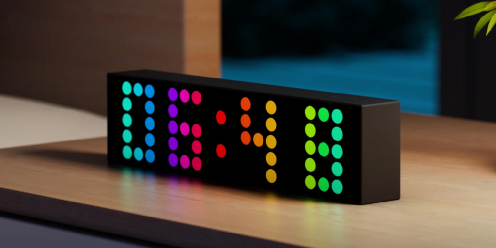

# Yeelight Cube Lite for Home Assistant

[](https://github.com/hacs/integration)
[](https://buymeacoffee.com/max.src)

A Home Assistant custom integration for the **Yeelight Cube Smart Lamp Lite**. This lamp features a **20×5 RGB LED matrix** (100 individually addressable pixels). This integration gives you full pixel-level control from your HA dashboard: draw pixel art, display scrolling text, apply gradients, color effects, transitions, and more.



---

## Features

### Light Integration

- **Full 20×5 RGB matrix control** — individual pixel-level color
- **Brightness control**
- **11 gradient & color modes** — solid, column/row/angle/radial gradients, letter gradients, color sequences
- **24 transition effects** — animated transitions between modes
- **13 color adjustment sliders** — hue shift, temperature, saturation, vibrance, contrast, glow, grayscale, invert, tint
- **Scrolling text** with configurable fonts and alignment
- **Multi-lamp support** — control multiple lamps in parallel from a single card
- **Auto-discovery** via Zeroconf (mDNS) — lamps advertising `_miio._udp.local.` are detected automatically
- **Auto-rediscovery** — if a lamp changes IP address, the integration automatically re-discovers it on the network
- **Local-only** — all communication stays on your LAN, no cloud dependency
- **Bundled Lit runtime** — frontend cards ship with a local Lit build, no CDN calls

### Customizable Lovelace Cards

- **Draw Card**: pixel art editor with pencil, eraser, fill, eyedropper, undo; gallery to save/load/rename/reorder/import/export designs
- **Gradient Card**: pick and preview all gradient & color modes with a scrollable mode wheel
- **Preview Card**: live matrix preview with brightness slider, power toggle, force refresh, and color adjustments panel (5 layout modes)
- **Palettes Card**: create, edit, reorder, and apply color palettes
- **Colors Card**: edit color sequences for Text Color Sequence and Panel Color Sequence modes with drag-and-drop

---

## Installation via HACS

### Add as Custom Repository

1. Open **HACS** in your Home Assistant dashboard
2. Click the **⋮** menu (top right) → **Custom repositories**
3. Add this URL:
   ```
   https://github.com/Max-src/yeelight-cube-lite
   ```
4. Category: **Integration**
5. Click **Add**
6. Search for **Yeelight Cube Lite** in HACS and install it
7. **Restart Home Assistant**

### Manual Installation

1. Download the [latest release](https://github.com/Max-src/yeelight-cube-lite/releases)
2. Copy the contents into `custom_components/yeelight_cube/` inside your HA config directory
3. Restart Home Assistant

---

## Setup

### Prerequisites — Yeelight Station App

Before adding the lamp to Home Assistant, you must first set it up using the **Yeelight Station** app (not the standard Yeelight app). This is where you configure Wi-Fi, enable LAN control, and find the IP address needed for the integration.

1. **Download the Yeelight Station app** from the App Store (iOS) or Google Play (Android)
2. **Power on the lamp**: connect the base unit to power using the included adapter, then place the Cube on top of the base (it attaches magnetically via the ring/pin connectors)
3. **Add the lamp to the app**: follow the in-app pairing instructions to connect the base unit to your **2.4 GHz Wi-Fi network**
4. **Enable LAN Control**: in the app, go to your device's **Device Settings** and turn on **LAN Control**. This is required for the Home Assistant integration to communicate with the lamp over your local network
5. **Find the lamp's IP address**: in the same Device Settings screen, locate the IP address assigned to the lamp on your network (e.g. `192.168.4.139`). Note this down — you will need it during the Home Assistant setup

<!-- TODO: Add screenshot of Yeelight Station app — Device Settings showing LAN Control toggle and IP address -->

> **Tip:** You can also find the lamp's IP address from your router's admin page or DHCP client list. Assigning a static IP / DHCP reservation for the lamp is recommended to prevent the address from changing.

### Adding to Home Assistant

1. Go to **Settings → Devices & Services**
2. Click **+ Add Integration** (bottom right)
3. Search for **Yeelight Cube Lite** and select it
4. Enter the **IP address** you noted from the Yeelight Station app (e.g. `192.168.4.139`)
5. Click **Submit**

<!-- TODO: Add screenshot of the Add Integration search showing Yeelight Cube Lite -->
<!-- TODO: Add screenshot of the IP address entry form -->

The integration will connect to the lamp over your local network and automatically create a device with all entities — light control, display mode selectors, color effect sliders, text input, transition settings, sensors, camera previews, and more (see [Entities Created](#entities-created) for the full list).

<!-- TODO: Add screenshot of the device page after successful setup -->

> **Note:** Each lamp (base unit) needs to be added separately. If you have multiple lamps, repeat the process for each one using their respective IP addresses.

> **Conflict prevention:** If you also have the built-in Home Assistant **Yeelight** integration, this custom integration will automatically prevent it from managing your Cube device to avoid conflicts. No manual action needed.

---

## Lovelace Cards

All cards are **auto-registered** when the integration loads — no manual resource configuration needed.

Every card comes with a **visual configuration editor** — click the pencil icon in the dashboard editor to customize any card without writing YAML. Each section of a card (colors, tools, gallery, buttons, matrix preview, etc.) can be **shown, hidden, restyled, or reordered** directly from the editor. Most sections offer **multiple display styles and layout modes**, so you can tailor the look and density of every card to fit your dashboard.

> After installing or updating, do a hard refresh (`Ctrl+F5`) in your browser if cards don't appear.

### Yeelight Draw Card: `custom:yeelight-cube-draw-card`

The main pixel art editor card. Every section is independently configurable.

<!-- TODO: Add screenshot of draw card here -->

**Features:**

- **20×5 interactive matrix**: click or drag to paint pixels — configurable pixel gap, pixel style (round/square), background color (transparent/white/black), box shadow, and size
- **Drawing tools**: color picker, pencil, eyedropper, eraser, area fill, fill all, undo — tools can be reordered, shown/hidden, with 6 button styles (modern, classic, outline, gradient, icon, pill) and content modes (icon, text, icon+text)
- **Palette section**: quick color selection with recent colors, lamp palette, and image palette — 5 layout modes (side-by-side, stacked, tabs, dropdown, preview-hover), swatch shapes (round/square), and configurable palette display (row, grid, expandable)
- **Pixel art gallery**: save, load, rename, reorder, import/export pixel art — 4 gallery view modes (gallery, list, carousel, album/coverflow), each with its own style settings (rounded cards, 3D album effect, carousel indicators, wrap navigation)
- **Upload from image**: upload bitmap images and auto-convert to the 20×5 matrix
- **Multi-entity support**: target multiple lamps simultaneously
- **Import/Export**: export full pixel art collections to JSON, import them back — button style customizable

### Yeelight Gradient Card: `custom:yeelight-cube-gradient-card`

Control the lamp's gradient and color modes from a single card.

<!-- TODO: Add screenshot of gradient card here -->

**Features:**

- **9 gradient/color modes**: Solid Color, Letter Gradient, Column Gradient, Row Gradient, Angle Gradient, Radial Gradient, Letter Angle Gradient, Letter Vertical Gradient, Text Color Sequence — modes can be reordered and individually shown/hidden
- **Color mode selector**: 5 display styles (buttons, colorized buttons, dropdown, compact, pills)
- **Two-color gradient control**: pick start and end colors per mode
- **Angle control**: real-time angle slider, number input, and rotary preview — 6 rotary styles (turning rectangle, arrow, star, wheel, rectangle, square), configurable size, and option to place in the header
- **Gradient preview**: 3 display modes (list, compact, wheel/carousel) with configurable pixel style (square/rounded/circle), gap, background, and preview size
- **Multi-entity support**: apply gradients to multiple lamps at once

### Yeelight Preview Card: `custom:yeelight-cube-lamp-preview-card`

A live preview of the lamp's current state, with controls.

<!-- TODO: Add screenshot of lamp preview card here -->

**Features:**

- **Live 20×5 matrix preview**: reflects the lamp's actual pixel colors — configurable pixel style (round/square), gap, background, box shadow, and size
- **Brightness slider**: 4 slider styles (slider, bar, rotary, capsule) — slider appearance (default/thick/thin), capsule theme (light/dark/transparent) with optional sun/moon icons, and label mode (text, icon, icon+text, hidden)
- **Power toggle & force refresh buttons**: 6 button styles (modern, classic, outline, gradient, icon, pill) with content modes
- **Color adjustments panel**: built-in color effect controls with 5 layout modes (compact, tabbed, grouped, radial, categories) — change indicators and configurable reset button visibility
- **Section styles**: 3 styles for each card section — flat (no outline), subtle (light border), filled (background tint) — plus full dark-mode support
- **Black dot handling**: optionally hide or show black (off) pixels for a cleaner preview

### Yeelight Palettes Card: `custom:yeelight-cube-palette-card`

Create, manage, and apply color palettes.

<!-- TODO: Add screenshot of palette card here -->

**Features:**

- **Visual palette display**: 5 swatch styles (round, square, gradient bar, gradient background, color stripes)
- **4 display modes**: list, gallery (with rounded card option), carousel (with configurable navigation), album/coverflow (with 3D effect)
- **Create & edit palettes**: add colors, rename, reorder, delete — configurable remove button style (default, red, black, trash, hidden)
- **Apply palette**: load a palette's colors onto the lamp
- **Import/Export**: save and load palette collections — button style customizable
- **Multi-entity support**: apply palettes to multiple lamps

### Yeelight Colors Card: `custom:yeelight-cube-color-list-editor-card`

Edit color sequences used by the "Text Color Sequence" and "Panel Color Sequence" display modes.

<!-- TODO: Add screenshot of color list editor card here -->

**Features:**

- **Visual color list**: add, remove, reorder colors in a sequence with drag-and-drop
- **7 layout modes**: compact, chips, tiles, rows, grid, cards, spread — each with its own density and look, configurable card size
- **Color picker**: rotary color picker with optional hex input and color name display
- **Configurable remove buttons**: 5 styles (default, red, black, trash, hidden), and for cards/spread layouts: button position (outside, inside, square)
- **Save & shuffle**: save as a named palette, randomize colors — action button styles customizable
- **Multi-entity support**: apply color sequences to multiple lamps

---

## Entities Created

Each Yeelight Cube Lite device creates the following entities:

### Light

| Entity                 | Description                                       |
| ---------------------- | ------------------------------------------------- |
| **Yeelight Cube Lite** | Main light entity (on/off, RGB color, brightness) |

### Selectors

| Entity                | Description                                                                                                                                                                                                           |
| --------------------- | --------------------------------------------------------------------------------------------------------------------------------------------------------------------------------------------------------------------- |
| **Display Mode**      | Switch between: Solid Color, Letter Gradient, Column Gradient, Row Gradient, Angle Gradient, Radial Gradient, Letter Vertical Gradient, Letter Angle Gradient, Text Color Sequence, Panel Color Sequence, Custom Draw |
| **Palette**           | Select from saved color palettes to apply to the lamp                                                                                                                                                                 |
| **Pixel Art**         | Select from saved pixel art designs to load onto the matrix                                                                                                                                                           |
| **Text Alignment**    | Text alignment: left, center, right                                                                                                                                                                                   |
| **Font**              | Choose the text font (multiple built-in bitmap fonts)                                                                                                                                                                 |
| **Transition Effect** | Choose from 24 transition animations when switching display modes                                                                                                                                                     |

### Numbers (Sliders)

| Entity                     | Description                                              |
| -------------------------- | -------------------------------------------------------- |
| **Gradient Angle**         | Angle for angle-based gradient modes (0°–360°)           |
| **Transition Steps**       | Number of animation steps for transitions (1–10)         |
| **Transition Duration**    | Total transition time in seconds (0.2–10s)               |
| **Color: Hue Shift**       | Shift all colors around the color wheel (−180° to +180°) |
| **Color: Temperature**     | Warm/cool color temperature adjustment (−100 to +100)    |
| **Intensity: Saturation**  | Color saturation level (0–200%)                          |
| **Intensity: Vibrance**    | Vibrance / adaptive saturation (0–200%)                  |
| **Tone: Contrast**         | Contrast level (0–200%)                                  |
| **Tone: Glow**             | Bloom / glow effect strength (0–100%)                    |
| **Effects: Grayscale**     | Grayscale intensity (0–100%)                             |
| **Effects: Invert**        | Color inversion intensity (0–100%)                       |
| **Effects: Tint Hue**      | Tint color hue (0°–360°)                                 |
| **Effects: Tint Strength** | Tint overlay intensity (0–100%)                          |

### Switches

| Entity               | Description                                                              |
| -------------------- | ------------------------------------------------------------------------ |
| **Auto Turn On**     | Automatically turn on the lamp when a new mode or drawing is applied     |
| **Flip Orientation** | Flip the matrix display horizontally (for mounting the lamp upside-down) |

### Text

| Entity           | Description                                                           |
| ---------------- | --------------------------------------------------------------------- |
| **Display Text** | Text input for custom text display on the matrix (supports scrolling) |

### Button

| Entity            | Description                                               |
| ----------------- | --------------------------------------------------------- |
| **Force Refresh** | Recover a stuck lamp by re-activating FX mode via raw TCP |

### Camera

| Entity                      | Description                                                                |
| --------------------------- | -------------------------------------------------------------------------- |
| **Matrix Preview (Square)** | Live camera feed of the matrix state, rendered with square pixels          |
| **Matrix Preview (Round)**  | Live camera feed of the matrix state, rendered with round LED-style pixels |

### Sensors

| Entity              | Description                                             |
| ------------------- | ------------------------------------------------------- |
| **Color Palettes**  | Stores all saved palettes (used by palette cards)       |
| **Saved Drawings**  | Stores all saved pixel art designs (used by draw cards) |
| **Font Characters** | Exposes the bitmap font character maps                  |

---

## Display Modes

The lamp supports the following display modes, selectable via the **Display Mode** entity or the Gradient Card:

| Mode                         | Description                                                         |
| ---------------------------- | ------------------------------------------------------------------- |
| **Solid Color**              | Fill the entire matrix with a single color                          |
| **Letter Gradient**          | Apply a horizontal gradient to each character of the displayed text |
| **Column Gradient**          | Vertical gradient across the 20 columns                             |
| **Row Gradient**             | Horizontal gradient across the 5 rows                               |
| **Angle Gradient**           | Gradient at a configurable angle (use the angle slider)             |
| **Radial Gradient**          | Gradient radiating outward from the center                          |
| **Letter Vertical Gradient** | Vertical gradient applied per character                             |
| **Letter Angle Gradient**    | Angled gradient applied per character                               |
| **Text Color Sequence**      | Each character gets a different color from the sequence             |
| **Panel Color Sequence**     | Color sequence applied across all pixels                            |
| **Custom Draw**              | Pixel art mode (use the Draw Card to paint individual pixels)       |

---

## Transition Effects

When switching between display modes or pixel art, you can apply animated transitions:

Fade Through Black, Direct Crossfade, Random Dissolve, Wipe (Right/Left/Down/Up), Slide (Left/Right/Up/Down), Card From (Right/Left/Top/Bottom), Explode & Reform, Snake, Wave Wipe, Iris (Circle Wipe), Vertical Flip, Curtain, Gravity Drop, Pixel Migration

Configure the effect, step count and duration via the **Transition Effect**, **Transition Steps** and **Transition Duration** entities.

---

## Requirements

- **Home Assistant** 2024.1.0 or newer
- **Yeelight Cube Smart Lamp Lite** (or compatible matrix/panel device) on the same local network
- Python packages `yeelight` and `Pillow` (installed automatically by HA)

---

## Troubleshooting

| Problem                                 | Solution                                                                                                                      |
| --------------------------------------- | ----------------------------------------------------------------------------------------------------------------------------- |
| **Cards not showing**                   | Clear browser cache with `Ctrl+F5` after installing or updating                                                               |
| **Device not found**                    | Ensure the lamp is on the same network. Check the IP in the Yeelight Station app. The integration also auto-discovers lamps via Zeroconf |
| **Conflicts with Yeelight integration** | This integration automatically dismisses built-in Yeelight discovery for your Cube devices and prevents it from managing them |
| **Lamp appears stuck / unresponsive**   | Press the **Force Refresh** button entity, or use the force refresh button on the Lamp Preview card                           |
| **Colors look off on the hardware**     | Color accuracy correction is built-in and applied automatically. It compensates for LED channel imbalance                     |
| **Lamp changed IP address**             | The integration automatically re-discovers lamps on the network. You can also update the IP from the integration's Configure page |

---

## License

See [LICENSE](LICENSE) for details.

---

## Support

If you find this integration useful, consider supporting development:

[](https://buymeacoffee.com/max.src)
