# Yeelight Cube Lite for Home Assistant

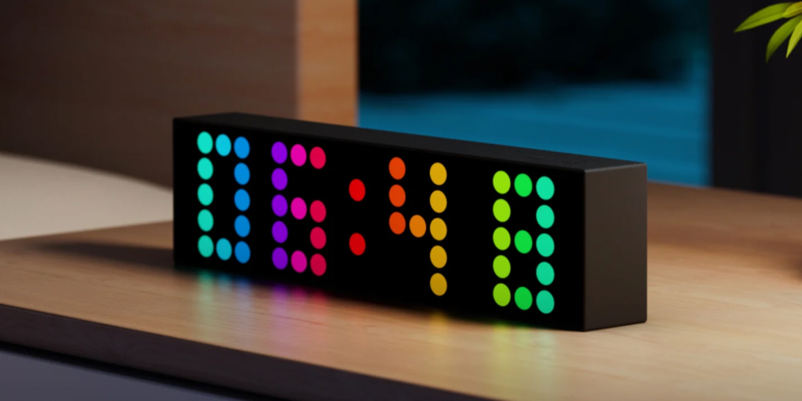

A Home Assistant custom integration for the **Yeelight Cube Smart Lamp Lite**, a lamp with a **20×5 RGB LED matrix** (100 individually addressable pixels). Get full pixel-level control from your HA dashboard: draw pixel art, display scrolling text, apply gradients, color effects, transitions, and more.

[![Home Assistant][ha_badge]][ha_link] [![HACS][hacs_badge]][hacs_link] [![GitHub Release][release_badge]][release] [![Buy Me a Coffee][bmac_badge]][bmac]

---

## Table of Contents

**[`Features`](#features)** · **[`Installation`](#installation-via-hacs)** · **[`Setup`](#setup)** · **[`Lovelace Cards`](#lovelace-cards)** · **[`Entities`](#entities-created)** · **[`Automations`](#automations--node-red)** · **[`Display Modes`](#display-modes)** · **[`Transition Effects`](#transition-effects)** · **[`Power Supply`](#power-supply)** · **[`Troubleshooting`](#troubleshooting)** · **[`License`](#license)**

---

## Features

### Light Integration

| Feature | Description |
| :-- | :-- |
| **Full matrix control** | 20×5 RGB, individual pixel-level color |
| **Brightness** | Full brightness control |
| **Native clock** | 10 firmware clock styles (more via Experimental Features) with time / date / alternating content, 12/24-hour, and colon blink options |
| **Native animations** | 18 LAN-compatible firmware effects with speed and direction controls where supported |
| **Music Flow** | 6 device-microphone reactive effects with display and power-state restoration |
| **Official pixel art** | 68 locally bundled, read-only drawings from the Yeelight Station app; personal drawings stay separate |
| **Device settings** | Power-on behavior, text scrolling, and physical-button preset list |
| **Colors & gradients** | Gradient support across multiple modes |
| **Color effects** | Hue shift, saturation, vibrance, tint, glow, contrast, invert, grayscale |
| **Transitions** | 23 animated transition effects |
| **Multi-lamp** | Control multiple lamps together or independently |
| **Auto-discovery** | Zeroconf (mDNS) auto-detection on your network |
| **Local-only** | All communication stays on your LAN, no cloud dependency |

### Customizable Lovelace Cards

| Card | Description |
| :-- | :-- |
| **[Preview Card](#preview-card)** | Live lamp preview with brightness and color adjustments |
| **[Clock Card](#clock-card)** | Time/date styles, color modes, live previews, favourites, and server-side rotation |
| **[Native Effects Card](#native-effects-card)** | Firmware animation previews, color modes, favourites, rotation, and lamp controls |
| **[Colors Card](#colors-card)** | Edit the colors used to display text and apply gradients |
| **[Palettes Card](#palettes-card)** | Manage reusable lists of colors (palettes) |
| **[Gradient Card](#gradient-card)** | Configure and preview gradient & color modes |
| **[Draw Card](#draw-card)** | Pixel art editor with a personal gallery |

> [!NOTE]
> All cards support **light and dark themes** and adapt automatically to your Home Assistant theme.

#### Clock Style Browsing

Both cards offer **Text**, **Live Preview**, and **Original** browsers in the
visual editor's **Previews** section. Styles follow your configured order and
automatically filter to those that respond to the selected color mode or RGB
override. This does not delete favourites. The former
`show_only_responding_styles` toggle is no longer used.

See [card configuration and behaviour](SERVICES.md#clock-and-native-effects-cards)
for layout options, offline editing, and multi-lamp rotation.

---

## Installation via HACS

### HACS (Recommended)

<div align="left">
  <a href="https://my.home-assistant.io/redirect/hacs_repository/?owner=Max-src&repository=yeelight-cube-lite" target="_blank" rel="noopener noreferrer">
    
  </a>
</div>

Or manually add the custom repository:

<details>
<summary>Step-by-step HACS installation</summary>

1. Open **HACS** in your Home Assistant dashboard
2. Click the **⋮** menu (top right) → **Custom repositories**
3. Add this URL and set the category to **Integration**, then click **Add**:
   ```
   https://github.com/Max-src/yeelight-cube-lite
   ```
4. The repository now appears in the custom repositories list. Close the dialog.
5. Back in HACS, search for **Yeelight Cube Lite** and open the result
6. Click **Download** (or **Install**) and confirm
7. **Restart Home Assistant**

</details>

### Manual Installation

1. Download the [latest release](https://github.com/Max-src/yeelight-cube-lite/releases)
2. Copy the contents into `custom_components/yeelight_cube/` inside your HA config directory
3. Restart Home Assistant

### Updating

After updating through HACS or replacing the integration files manually, restart
Home Assistant so the updated Python code and new entities are loaded. Existing
device entries, settings, palettes, and personal pixel art are preserved. If a
dashboard card does not update after the restart, perform a hard browser refresh
(`Ctrl+F5`).

---

## Setup

### Prerequisites: Yeelight Station App

Before adding the lamp to Home Assistant, you must first set it up using the **Yeelight Station app** (not the standard Yeelight app).

<details>
<summary>View setup steps</summary>

1. **Download the Yeelight Station app** from the App Store (iOS) or Google Play (Android)
2. **Power on the lamp**
3. **Add the lamp to the app**: follow the in-app instructions to connect the lamp to your **2.4 GHz Wi-Fi network**
4. **Enable LAN Control**: in the app, go to your lamp's **Device Settings** and activate **LAN Control**. This is required for the integration to communicate with the lamp over your local network
5. **Find the lamp's IP address**: in Device Settings → **Device info**, find the IP address assigned to the lamp (e.g. `192.168.4.139`)

<table>
  <tr>
    <td></td>
    <td></td>
    <td></td>
  </tr>
</table>

<blockquote><strong>💡 Tip:</strong> You can also find the lamp's IP from your router's admin page or DHCP client list. Assigning a <strong>static IP / DHCP reservation</strong> is recommended.</blockquote>

</details>

### Adding to Home Assistant

#### Automatic Discovery (recommended)

Once the lamp is on your network with LAN Control enabled, Home Assistant will **automatically detect it** via Zeroconf (mDNS) - no IP address needed.

<details>
<summary>View discovery steps</summary>

1. Look for the **Yeelight Cube Lite** discovery notification on **Settings → Devices & Services**

   

2. Click **Add**

   

3. Confirm to set up the device

   

4. Done. The integration creates all entities automatically.

   

<blockquote><strong>ℹ️ Note:</strong> If you also use the official Yeelight integration, it may generate a discovery notification for the same lamp. That notification is <strong>automatically suppressed</strong> by this integration - you can safely ignore it.</blockquote>

<blockquote><strong>💡 Tip:</strong> <strong>IP address changes:</strong> The integration uses auto-rediscovery. If the lamp gets a new IP (e.g. after a router reboot), the integration finds it again automatically.</blockquote>

</details>

#### Manual Setup (alternative)

If the lamp is not discovered automatically (e.g. different subnet or mDNS is blocked):

<details>
<summary>View manual setup steps</summary>

1. Go to **Settings → Devices & Services**
2. Click **+ Add Integration** (bottom right)
3. Search for **Yeelight Cube Lite** and select it
4. On this integration detail page, click **Add entry**

   

5. Enter the **IP address** from the Yeelight Station app (e.g. `192.168.4.139`)

   

6. Click **Submit**

   

<blockquote><strong>ℹ️ Note:</strong> Each lamp needs to be added separately. If you have multiple lamps, repeat the process for each one.</blockquote>

</details>

---

## Lovelace Cards

This component includes custom Lovelace cards for your dashboards.

Every card comes with a **visual configuration editor** - click the pencil icon to customize without YAML. Each section can be configured independently, and most sections offer **multiple display styles and layout modes**.

> [!IMPORTANT]
> After installing or updating, do a hard refresh (`Ctrl+F5`) in your browser if the cards don't appear.

<table>
  <tr>
    <td></td>
    <td></td>
  </tr>
</table>

<a id="clock-card"></a>

### Clock Card (`custom:yeelight-cube-clock-card`)

Browse firmware clock styles with live time/date previews, choose a color mode
or custom RGB, and save your favourite style-and-color combinations. The card
also provides content/format controls, brightness, animation speed, and a
server-side favourites rotation that continues after you close the dashboard.

<details>
<summary>View card variations</summary>

<!-- card-docs:clock:variations:start -->
<table>
  <tr>
    <td valign="top">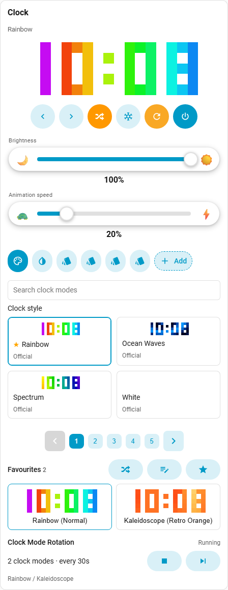<br>Square pixels and capsule sliders</td>
    <td valign="top">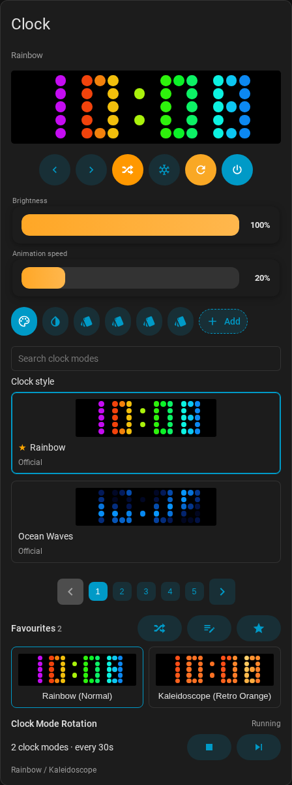<br>Dark theme, round pixels and list gallery</td>
    <td valign="top">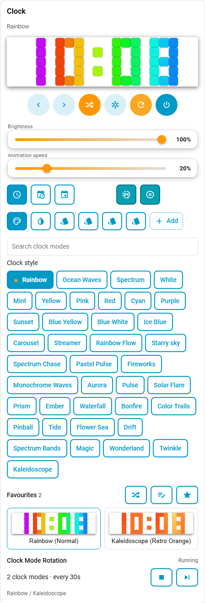<br>Rounded pixels and compact text styles</td>
  </tr>
  <tr>
    <td valign="top">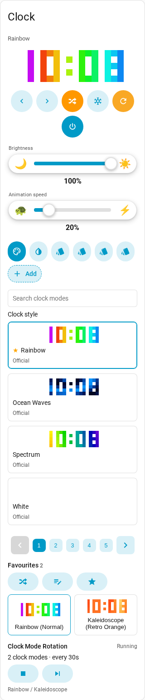<br>Narrow dashboard column</td>
    <td valign="top">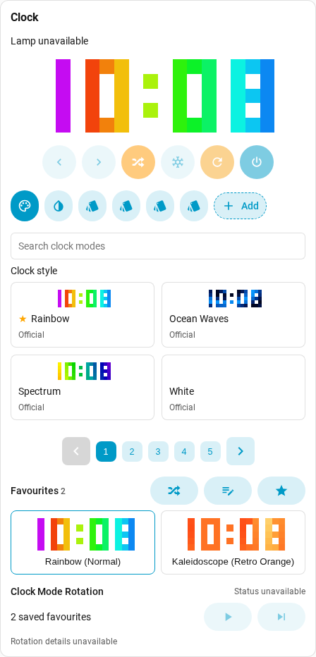<br>Local previews while the lamp is unavailable</td>
    <td valign="top">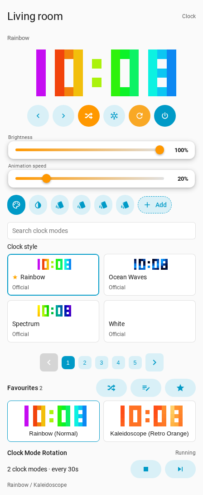<br>Card title, lamp status and no card background</td>
  </tr>
</table>
<!-- card-docs:clock:variations:end -->

</details>

**Features:**

| Feature | Description |
| :-- | :-- |
| **Clock preview** | Live time/date preview using the lamp's native font, with configurable pixels, spacing, background, shadow and size |
| **Style browser** | Search clock styles using text (buttons, dropdown, or chips with a live mini preview), grid, list, strip, carousel, wheel or album layouts, with pagination and favourite markers. The editor's **Styles** list picks, orders and renames them for the card. Your custom styles can be renamed and deleted (with confirmation) from the gallery |
| **Color modes** | Choose supported palettes or custom RGB; save reusable color modes and clock presets |
| **Sliders** | Brightness and animation speed with selectable slider styles, labels and values |
| **Content & format** | Switch time/date, 12/24-hour format and colon blinking |
| **Actions** | Previous, next, random, freeze, refresh and power controls |
| **Favourites & rotation** | Save style-and-color combinations on the lamp (the same on every dashboard and device); rotate at a configurable interval, even after closing the dashboard |
| **Multiple lamps & offline editing** | Target several lamps; previews and color choices remain available while lamps are unavailable |

<details>
<summary>View editor sections</summary>

<!-- card-docs:clock:editors:start -->
<table>
  <tr>
    <td valign="top">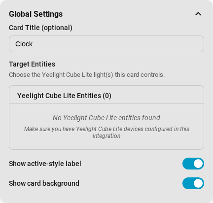<br>Global Settings</td>
    <td valign="top">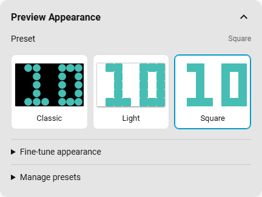<br>Preview Appearance</td>
    <td valign="top">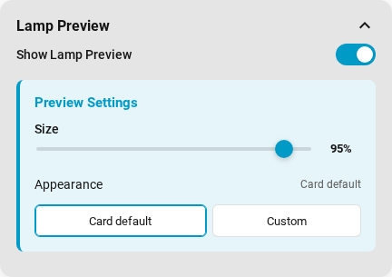<br>Lamp Preview</td>
  </tr>
  <tr>
    <td valign="top">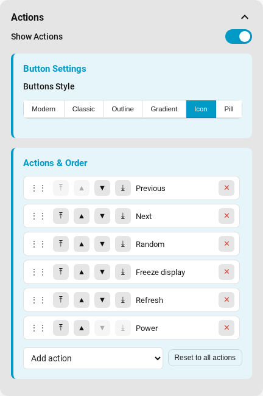<br>Actions</td>
    <td valign="top">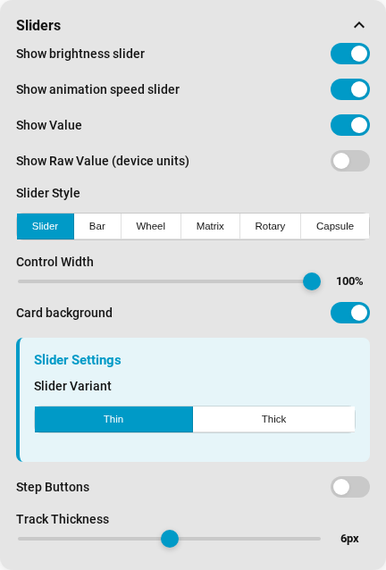<br>Sliders</td>
    <td valign="top">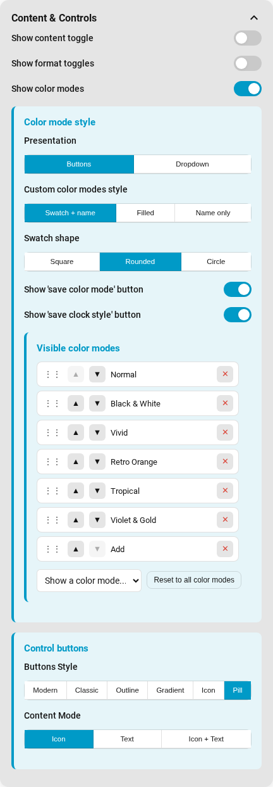<br>Content &amp; Controls</td>
  </tr>
  <tr>
    <td valign="top">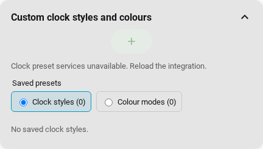<br>Custom clock styles and colors</td>
    <td valign="top">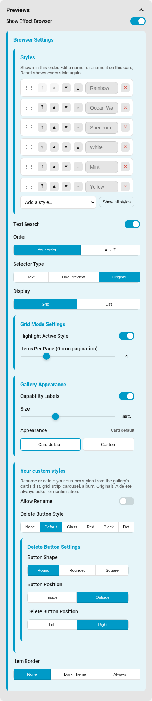<br>Previews</td>
    <td valign="top">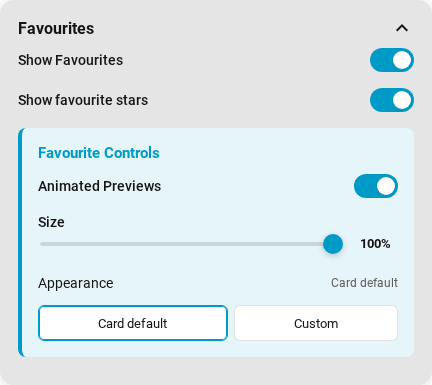<br>Favourites</td>
  </tr>
  <tr>
    <td valign="top">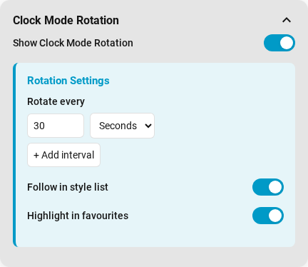<br>Clock Mode Rotation</td>
  </tr>
</table>
<!-- card-docs:clock:editors:end -->

</details>

<details>
<summary>YAML example</summary>

```yaml
type: custom:yeelight-cube-clock-card
entity: light.cubelite_a904
title: Clock
show_current_preview: true
show_brightness: true
show_animation_speed: true
slider_style: capsule
show_color_modes: true
show_gallery: true
style_selector_style: original
effect_view: grid
items_per_page: 4
show_favourites: true
show_rotation: true
rotation_interval: 30
```

</details>

Use `target_entities` with a list of light entity IDs to control multiple lamps.
See [configuration and storage details](SERVICES.md#clock-and-native-effects-cards).

---

<a id="native-effects-card"></a>

### Native Effects Card (`custom:yeelight-cube-native-effects-card`)

Browse the lamp's firmware animations with local animated previews. Choose
supported palette modes or custom RGB, manage favourites, and rotate through
them. Brightness, speed, orientation, Freeze, Refresh, and power controls are
available where supported. Experimental effects require the lamp's
**Experimental Features** setting for playback.

<details>
<summary>View card variations</summary>

<!-- card-docs:native-effects:variations:start -->
<table>
  <tr>
    <td valign="top">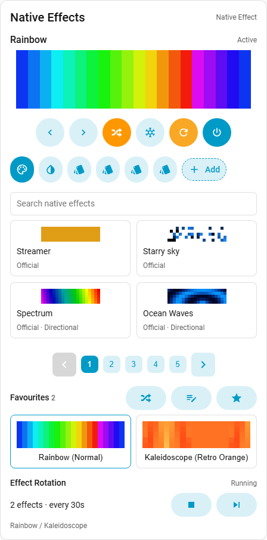<br>Square pixels and capsule sliders</td>
    <td valign="top">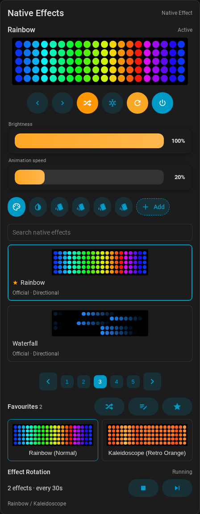<br>Dark theme, round pixels and list gallery</td>
    <td valign="top">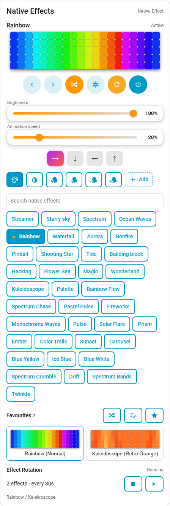<br>Rounded pixels and compact text effects</td>
  </tr>
  <tr>
    <td valign="top">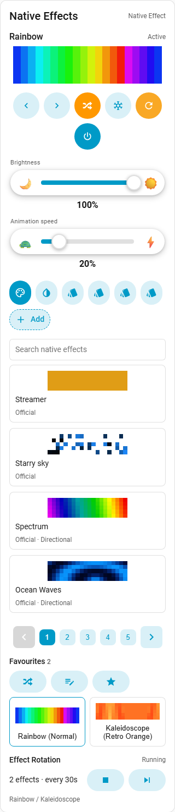<br>Narrow dashboard column</td>
    <td valign="top">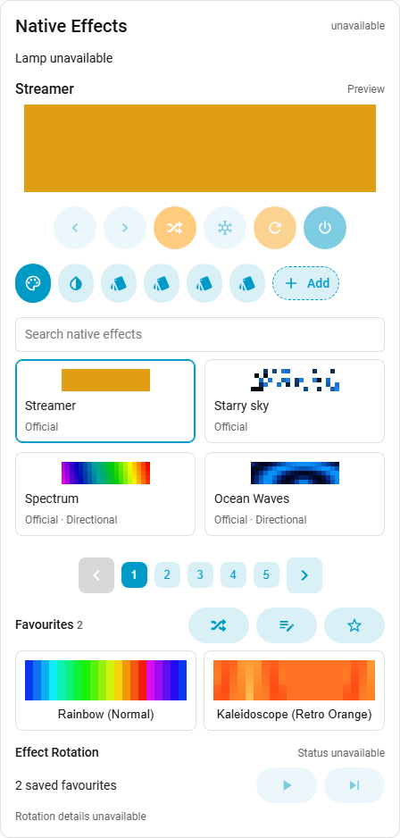<br>Local previews while the lamp is unavailable</td>
    <td valign="top">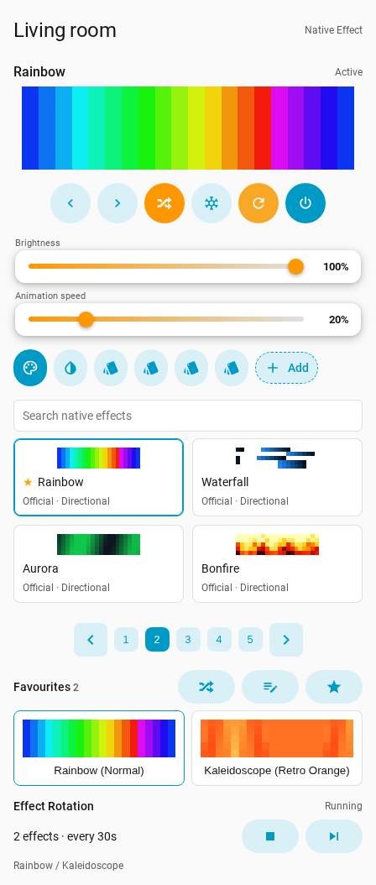<br>Card title, lamp status and no card background</td>
  </tr>
</table>
<!-- card-docs:native-effects:variations:end -->

</details>

**Features:**

| Feature | Description |
| :-- | :-- |
| **Live previews** | Preview firmware animations with configurable pixels, spacing, background, shadow and size |
| **Effect browser** | Search effects using text (buttons, dropdown, or chips with a live mini preview), grid, list, strip, carousel, wheel or album layouts, with pagination and availability badges. The editor's **Effects** list picks, orders and renames them for the card |
| **Color modes** | Apply supported palette modes or custom RGB; favourites remember the chosen colors |
| **Sliders** | Brightness and effect speed with selectable slider styles; speed is shown for effects that support it |
| **Orientation & actions** | Device orientation, previous, next, random, freeze, refresh and power controls |
| **Favourites & rotation** | Order saved effect-and-color combinations and rotate them on the lamp at a configurable interval |
| **Multiple lamps & offline editing** | Control several targets; browse previews even while lamps are unavailable |

<details>
<summary>View editor sections</summary>

<!-- card-docs:native-effects:editors:start -->
<table>
  <tr>
    <td valign="top">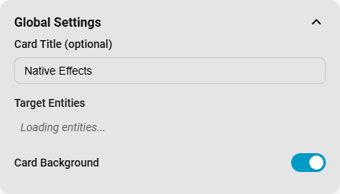<br>Global Settings</td>
    <td valign="top"><br>Preview Appearance</td>
    <td valign="top">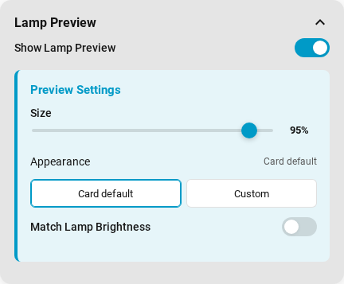<br>Lamp Preview</td>
  </tr>
  <tr>
    <td valign="top"><br>Actions</td>
    <td valign="top"><br>Sliders</td>
    <td valign="top">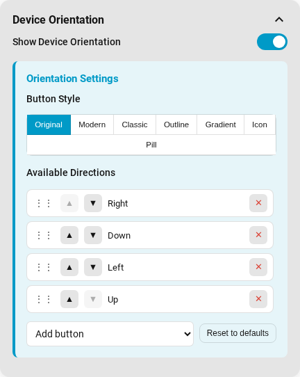<br>Device Orientation</td>
  </tr>
  <tr>
    <td valign="top">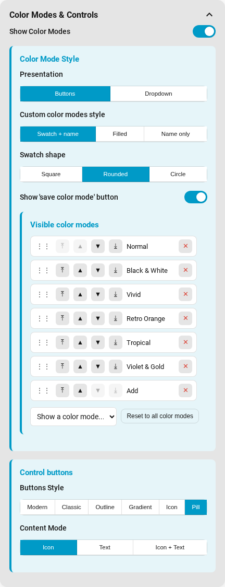<br>Color Modes &amp; Controls</td>
    <td valign="top">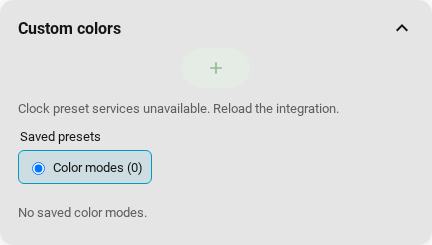<br>Custom colors</td>
    <td valign="top">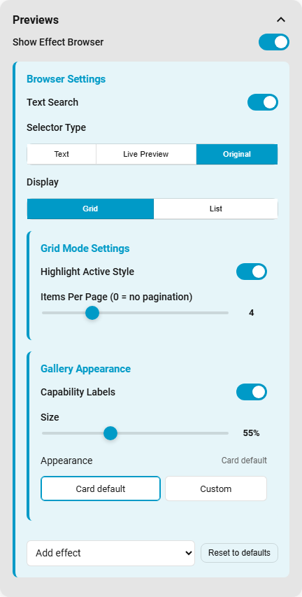<br>Previews</td>
  </tr>
  <tr>
    <td valign="top">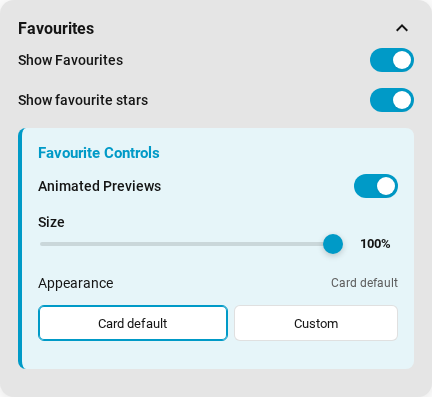<br>Favourites</td>
    <td valign="top">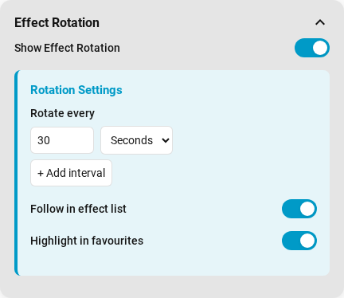<br>Effect Rotation</td>
  </tr>
</table>
<!-- card-docs:native-effects:editors:end -->

</details>

<details>
<summary>YAML example</summary>

```yaml
type: custom:yeelight-cube-native-effects-card
entity: light.cubelite_a904
title: Native Effects
show_preview: true
show_brightness: true
show_animation_speed: true
slider_style: capsule
show_color_modes: true
show_gallery: true
style_selector_style: original
effect_view: grid
items_per_page: 4
show_favourites: true
show_rotation: true
rotation_interval: 30
```

</details>

**Shared behaviour:** favourites store the style/effect together with its color
mode and custom RGB, separately for Clock and Native Effects. They are saved on
the lamp in Home Assistant (a card with several lamps shows the first lamp's list
and saves it to all of them), so every dashboard, browser and device shows the
same favourites, rotation interval and rotation status. A running rotation is
resumed after a Home Assistant restart. Add at least two available
favourites to start rotation. For multiple lamps, use `target_entities` with a
list of light entity IDs on either card.

**When a lamp is unavailable:** previews and color choices remain usable, and
the last known favourites stay shown (they are edited again once the lamp is
back), even if the entity temporarily disappears. Hardware
controls are gated. Reconnection discards local preview drafts without sending
them to the lamps. Unknown rotation status is not treated as an active rotation.

See [configuration and storage details](SERVICES.md#clock-and-native-effects-cards),
[service calls](SERVICES.md#-clock-native-effects-and-rotation).

---

<a id="preview-card"></a>

### 🖥️ Preview Card (`custom:yeelight-cube-lamp-preview-card`)

A live dashboard card that mirrors the lamp's current state with real-time matrix preview, brightness slider, power & refresh actions, and color adjustments panel.

<details>
<summary>View card variations</summary>

<!-- card-docs:lamp-preview:variations:start -->
<table>
  <tr>
    <td valign="top">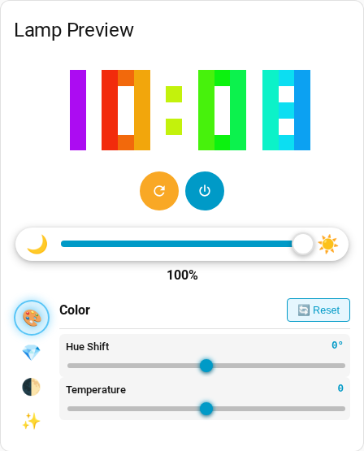<br>Light theme with brightness and color adjustments</td>
    <td valign="top">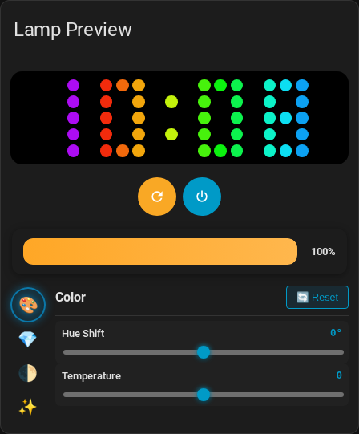<br>Dark theme with round pixels</td>
    <td valign="top">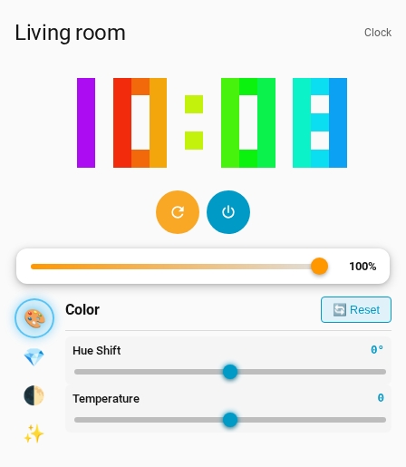<br>Card title, lamp status and no card background</td>
  </tr>
</table>
<!-- card-docs:lamp-preview:variations:end -->

</details>

<details>
<summary>More layout examples</summary>

<table>
  <tr>
    <td></td>
    <td></td>
    <td></td>
    <td></td>
    <td>
    </td>
  </tr>
</table>

</details>

**Features:**

| Feature | Description |
| :-- | :-- |
| **Lamp preview** | Reflects what's displayed on the lamp. Configurable pixel style, spacing, background, shadow, and size |
| **Refresh & power** | Quick buttons to force-refresh or toggle power |
| **Device orientation** | Right / Down / Left / Up control with configurable button layout; the preview rotates to match the physical mount |
| **Brightness slider** | Configurable slider styles |
| **Color adjustments** | Effect sliders with multiple layout modes, change indicators, and reset buttons |

<details>
<summary>View editor sections</summary>

<!-- card-docs:lamp-preview:editors:start -->
<table>
  <tr>
    <td valign="top">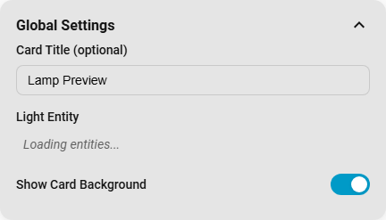<br>Global Settings</td>
    <td valign="top">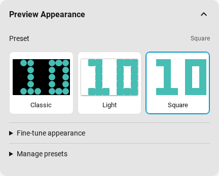<br>Preview Appearance</td>
    <td valign="top">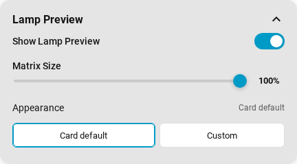<br>Lamp Preview</td>
  </tr>
  <tr>
    <td valign="top">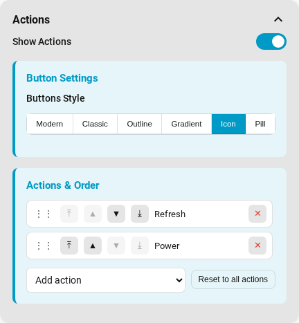<br>Actions</td>
    <td valign="top">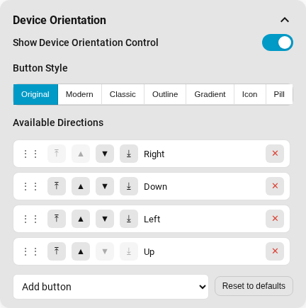<br>Device Orientation</td>
    <td valign="top">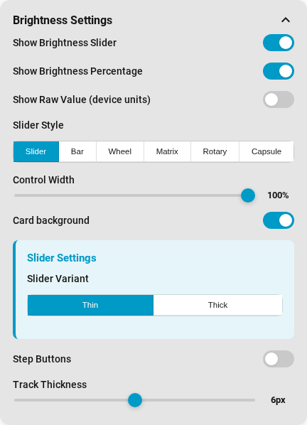<br>Brightness Settings</td>
  </tr>
  <tr>
    <td valign="top">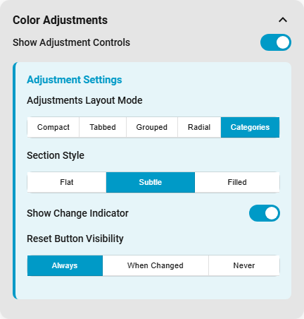<br>Color Adjustments</td>
  </tr>
</table>
<!-- card-docs:lamp-preview:editors:end -->

</details>

---

<a id="colors-card"></a>

### 🎨 Colors Card (`custom:yeelight-cube-color-list-editor-card`)

Edit the ordered list of colors used by text display on the lamp. Add, delete, drag to reorder, shuffle, and save as a reusable palette.

<details>
<summary>View card variations</summary>

<table>
  <tr>
    <td></td>
    <td></td>
    <td></td>
    <td></td>
    <td></td>
  </tr>
</table>

</details>

**Features:**

| Feature | Description |
| :-- | :-- |
| **Multi-entity support** | Control multiple lamps at the same time |
| **Color list** | Add, remove, reorder with drag-and-drop. Multiple layout modes, optional hex/name display |
| **Color edit** | Color picker or hex input |
| **Actions** | Add, shuffle, and save as reusable palette |

<details>
<summary>View editor sections</summary>

<table>
  <tr>
    <td></td>
    <td></td>
    <td></td>
  </tr>
</table>

</details>

---

<a id="palettes-card"></a>

### 🎭 Palettes Card (`custom:yeelight-cube-palette-card`)

Manage color palettes. Apply a palette to lamps with one click. Multiple display modes supported.

<details>
<summary>View card variations</summary>

<table>
  <tr>
    <td></td>
    <td></td>
    <td></td>
    <td>
    </td>
  </tr>
</table>

</details>

**Features:**

| Feature | Description |
| :-- | :-- |
| **Multi-entity support** | Control multiple lamps at the same time |
| **Browse & apply** | The shared gallery: List, Grid, Strip, Carousel, Wheel or Album previews, or Filled, Dropdown or Chips buttons, with optional search; five swatch styles (round, square, gradient bar, gradient background, stripes) and the color count; one-click (or keyboard) apply; in the carousel and wheel the arrows only browse, a click applies |
| **Manage** | Rename (Allow Rename) and delete palettes from the gallery; a delete always asks for confirmation |
| **Arrange** | Reorder your palettes in the card editor (drag or ▲ ▼); the order is saved for every card, lamp and the Matrix: Palette select |
| **Import/Export** | Load and save full palette collections |

<details>
<summary>View editor sections</summary>

<table>
  <tr>
    <td></td>
    <td></td>
    <td></td>
  </tr>
</table>

</details>

---

<a id="gradient-card"></a>

### 🌈 Gradient Card (`custom:yeelight-cube-gradient-card`)

Select and configure gradient/color modes. Adjust gradient direction with an angle control. Preview all gradient modes live.

<details>
<summary>View card variations</summary>

<table>
  <tr>
    <td></td>
    <td></td>
    <td></td>
    <td></td>
    <td></td>
  </tr>
</table>

</details>

**Features:**

| Feature | Description |
| :-- | :-- |
| **Multi-entity support** | Control multiple lamps at the same time |
| **Unified mode selector** | The same gallery as the Clock and Native Effects cards: 3 lightweight **text** styles (Filled, Dropdown, Chips with live gradient swatches) or 6 **live preview** styles (List, Grid, Strip, Carousel, Wheel, Album) that render a mini matrix of every mode with your current text, colors, and angle — click to apply. Optional text search; the editor's **Modes** list picks, orders and renames them for the card |
| **Shared appearance axes** | **Shape** (Square / Rounded / Round) and **Size** apply consistently to every selector style — same design language as the other cards |
| **Selection feedback** | The chosen item pulses while the command is in flight and settles once the lamp confirms |
| **Active mode label** | Optional chip showing the currently active mode by name (handy when titles are hidden) |
| **Mode visibility** | Hide modes you never use via per-mode eye toggles (edit mode in the card editor) |
| **Apply to whole panel** | Independent toggle to apply gradients to the full panel instead of just the text |
| **Angle selector** | Slider, number input, or rotary control (rectangle, wheel, compass, mini-matrix, capsule) |

> **Upgrading from an older version?** The former "Color Mode Selector" and "Gradient Preview" sections were merged into a single **Mode Selector** — they served the same purpose. Existing configs migrate automatically to the matching preview style; pick a text style in the editor if you prefer the old compact buttons. Text styles skip the preview computation entirely, making them noticeably lighter.

<details>
<summary>View editor sections</summary>

<table>
  <tr>
    <td></td>
    <td></td>
    <td></td>
  </tr>
</table>

The editor also has **Preview Appearance** (the shared matrix look, see
[Shared Preview Appearance](SERVICES.md#shared-preview-appearance)),
**Active Mode Label** and **Apply to Whole Panel** sections.

</details>

---

<a id="draw-card"></a>

### ✏️ Draw Card (`custom:yeelight-cube-draw-card`)

The pixel art editor. Paint on a 20×5 interactive matrix, save designs to a personal gallery, and push artwork to one or more lamps with a single tap.

<details>
<summary>View card variations</summary>

<table>
  <tr>
    <td></td>
    <td></td>
    <td></td>
    <td></td>
  </tr>
</table>

</details>

**Features:**

| Feature | Description |
| :-- | :-- |
| **Multi-entity support** | Control multiple lamps at the same time |
| **Colors section** | Quick access to recent, palette, current, and drawing colors |
| **Drawing tools** | Individually toggleable with multiple styles |
| **Drawing matrix** | Interactive 20×5 matrix |
| **Action buttons** | Apply to lamp, upload from image, save, or clear |
| **Pixel art gallery** | The shared gallery: Grid, List, Strip, Carousel, Wheel or Album previews, or Filled, Dropdown or Chips buttons, with optional search. A pick (a click; carousel and wheel arrows only browse) loads the pixel art into the drawing (and sends it to the lamp with "Apply to lamp automatically"). Rename (Allow Rename) and delete them from the gallery (a delete always asks for confirmation); reorder them in the card editor's Arrange list (saved for every card and the Matrix: Pixel Art select) |
| **Import/Export** | Import and export collections as JSON |

<details>
<summary>View editor sections</summary>

<table>
  <tr>
    <td></td>
    <td></td>
    <td></td>
    <td></td>
    <td></td>
    <td></td>
    <td></td>
    <td></td>
  </tr>
</table>

A **Preview Appearance** section (the shared matrix look, see
[Shared Preview Appearance](SERVICES.md#shared-preview-appearance)) sits
between Drawing Tools and Drawing Matrix Section.

</details>

---

## Entities Created

Each lamp creates its own set of per-device entities, plus the integration creates **global entities** (palettes, drawings, fonts, clock color presets) shared across all lamps.

> [!NOTE]
> The names below are the entity names shown on the device page. Matrix-only
> controls carry a `Matrix:` prefix and clock options a `Clock:` prefix so they
> group together. Entity IDs are derived from the lamp name, e.g.
> `select.cubelite_a904_matrix_display_mode`.

### Per-device Entities

<details>
<summary>View entity screenshots</summary>

<table>
  <tr>
    <td></td>
    <td></td>
    <td></td>
    <td></td>
  </tr>
</table>

</details>

#### Controls

| Entity | Type | Description |
| :-- | :-- | :-- |
| **Auto Turn On** | Switch | Automatically turn on the lamp when a mode, drawing or color change is applied while it is off |
| **Yeelight Cube Lite** | Light | Main light entity (on/off and brightness; RGB color in Matrix mode) |
| **Content mode** | Select | Switch between Matrix, firmware-native Clock, Native Effect, and Music Flow |
| **Matrix: Display Mode** | Select | Choose the Matrix render mode (see [Display Modes](#display-modes)) |
| **Matrix: Display Text** | Text | Text shown by the Matrix text modes |
| **Matrix: Font** | Select | Basic, Fat, Italic, or Native (Basic with the firmware clock's digit shapes) |
| **Matrix: Text Alignment** | Select | Text alignment: left, center, right |
| **Matrix: Gradient Angle** | Number | Angle for angle-based gradient modes (0°–360°) |
| **Matrix: Palette** | Select | Apply one of the saved color palettes |
| **Matrix: Pixel Art** | Select | Personal drawings followed by the 68 locally bundled, read-only official presets |
| **Clock: Style** | Select | One of the 10 native clock styles (more with Experimental Features) |
| **Native effect** | Select | One of the 18 LAN-compatible firmware-native animations (more with Experimental Features) |
| **Animation speed** | Number | Speed for the native clock and for effects that support it (1–255 device units; unavailable when the selected effect has no speed control) |
| **Music Flow effect** | Select | Gather, Breathing, Blossom, Spectrum, Music Note, or Impact |
| **Device Orientation** | Select | Physical mount orientation: Right / Down / Left / Up (applies to all modes) |
| **Experimental Features** | Switch | Reveal firmware animation modes and clock styles the Yeelight app never exposed. Off by default |

#### Sensors

| Entity | Type | Description |
| :-- | :-- | :-- |
| **Matrix Preview (Round)** | Camera | Local matrix preview with round pixels; Music Flow uses a static effect illustration |
| **Matrix Preview (Square)** | Camera | Local matrix preview with square pixels; Music Flow uses a static effect illustration |
| **Estimated power** | Sensor | Estimated power draw of the lamp in W. See [Power Supply](#power-supply) |
| **Estimated energy** | Sensor | Estimated energy used by the lamp in kWh, for the Energy dashboard. See [Power Supply](#power-supply) |

> [!TIP]
> Use these camera entities with a "Picture Entity" card for quick previews. For more responsive previews, use the custom [Preview Card](#preview-card).

#### Configuration

| Entity | Type | Description |
| :-- | :-- | :-- |
| **Clock: Content** | Select | What the clock shows: Time, Time & Date (alternating), or Date only |
| **Clock: Show date** | Switch | Shortcut for Time & Date (alternate time with the date); stays in sync with Clock: Content |
| **Clock: 12-hour format** | Switch | Use 12-hour time instead of 24-hour time |
| **Clock: Blink colon** | Switch | Blink the time separator in Clock mode |
| **Native effect: Direction** | Select | Direction for effects that support movement (Up / Down / Left / Right; Hacking offers Up / Down only) |
| **Power-on behavior** | Select | Choose Off, On, or Toggle after mains power is restored |
| **Text scroll** | Switch | Enable scrolling for text wider than the matrix |
| **Text scroll: Interval** | Number | Delay between scroll steps (0.05–2 seconds) |
| **Color: Hue Shift** | Number | Shift colors around the wheel (−180° to +180°) |
| **Color: Temperature** | Number | Warm/cool adjustment (−100 to +100) |
| **Effects: Grayscale** | Number | Grayscale intensity (0–100%) |
| **Effects: Invert** | Number | Color inversion intensity (0–100%) |
| **Effects: Tint Hue** | Number | Tint color hue (0°–360°) |
| **Effects: Tint Strength** | Number | Tint overlay intensity (0–100%) |
| **Intensity: Saturation** | Number | Saturation level (0–200%) |
| **Intensity: Vibrance** | Number | Adaptive saturation (0–200%) |
| **Tone: Contrast** | Number | Contrast level (0–200%) |
| **Tone: Glow** | Number | Bloom / glow effect (0–100%) |
| **Matrix: Transition Effect** | Select | None or one of the 23 [transition animations](#transition-effects) |
| **Transition Steps** | Number | Animation steps (1–10) |
| **Transition Duration** | Number | Transition time (0.2–10 s) |
| **Power limit** | Number | Dim bright pictures to keep the lamp under this many watts (7 W = off). See [Power Supply](#power-supply) |

#### Diagnostic

| Entity | Type | Description |
| :-- | :-- | :-- |
| **Force Refresh** | Button | Re-activate connection for a stuck lamp |
| **IP Address** | Sensor | Current IP address (updated after rediscovery) |

### Global Entities

These sensor entities are created **once per integration install** and shared across all lamps.

> [!NOTE]
> Entity IDs are generated from the entity name the first time it is created,
> so they differ between installations: a fresh install gets
> `sensor.saved_drawings`, `sensor.color_palettes`, `sensor.font_characters`
> and `sensor.clock_color_presets`, while older installations may still use
> `sensor.yeelight_cube_saved_pixel_arts`, `sensor.yeelight_cube_color_palettes`
> and `sensor.yeelight_cube_font_letter_map`. Check **Settings → Devices &
> services → Entities** and adjust the examples below. The cards find these
> sensors by their attributes, not by ID.

<details>
<summary>View global entities details</summary>

<table>
  <tr>
    <td></td>
  </tr>
</table>

#### Saved Drawings (`sensor.saved_drawings`)

Stores all pixel art designs created with the Draw Card.

| Attribute | Type | Description |
| :-- | :-- | :-- |
| `pixel_arts` | list | Ordered list of saved pixel arts (each has `name` + `pixels`) |
| `count` | integer | Number of saved pixel arts |
| `content_hash` | string | MD5 hash; changes on every modification |

**State:** `"N drawings"` (e.g. `"3 drawings"`)

**How to use:** The index in `pixel_arts` corresponds to the index passed to `apply_pixel_art`, `remove_pixel_art`, etc. (0-based):

```yaml
# In Developer Tools → Template
{{ state_attr('sensor.saved_drawings', 'pixel_arts')
   | map(attribute='name') | list }}
# → ['Magic Lamp', 'Bat', 'Whale']
# 'Magic Lamp' = index 0, 'Bat' = index 1, 'Whale' = index 2
```

---

#### Color Palettes (`sensor.color_palettes`)

Stores all saved color palettes.

| Attribute | Type | Description |
| :-- | :-- | :-- |
| `palettes_v2` | list | Ordered list of palettes (each has `name` + `colors`) |
| `count` | integer | Number of saved palettes |
| `content_hash` | string | MD5 hash; changes on every modification |

**State:** numeric count (e.g. `3`)

---

#### Font Characters (`sensor.font_characters`)

Read-only bitmap font maps used for text rendering.

| Attribute | Type | Description |
| :-- | :-- | :-- |
| `font_maps` | object | Dictionary with keys `"basic"`, `"fat"`, `"italic"` and `"native"` mapping characters to pixel bitmaps |
| `font_metrics` | object | Per-font spacing metrics (currently `"native"`: monospace advance and narrow-glyph overrides) used by the clock previews |

**State:** always `"ready"` - content is static and never changes at runtime.

---

#### Clock Color Presets (`sensor.clock_color_presets`)

Stores the shared library of saved clock styles and reusable color modes
managed by the Clock and Native Effects cards (see
[`save_clock_preset`](SERVICES.md#save_clock_preset--delete_clock_preset)).

| Attribute | Type | Description |
| :-- | :-- | :-- |
| `clock_presets` | list | Saved presets (each has `id`, `name`, `color` and `kind` = `style` or `color_mode`); at most 100 |

**State:** numeric count (e.g. `2`)

</details>

---

## Automations & Node-RED

All entities (light, selectors, sliders, text, switches) can be used in standard automations, scripts, and Node-RED flows. The integration also registers **custom actions (services)** under the `yeelight_cube` domain.

> [!NOTE]
> For a complete reference of all available actions with full field descriptions and examples, see [SERVICES.md](SERVICES.md).

### Quick Reference

#### Display Control

| Action | Description | Key Fields |
| :-- | :-- | :-- |
| `yeelight_cube.set_custom_text` | Display text on the matrix | `text`, `entity_id` |
| `yeelight_cube.set_mode` | Switch display mode | `mode`, `entity_id` |
| `yeelight_cube.set_solid_color` | Set a single solid color | `rgb_color`, `entity_id` |
| `yeelight_cube.set_angle` | Set gradient angle | `angle` (0–360), `entity_id` |
| `yeelight_cube.set_brightness` | Set brightness | `brightness` (1–100), `entity_id` |
| `yeelight_cube.set_button_effects` | Update the physical-button preset slots | `effects` (1–8 names), `entity_id` |

#### Pixel Art

| Action | Description | Key Fields |
| :-- | :-- | :-- |
| `yeelight_cube.apply_custom_pixels` | Push pixel array to lamp | `pixels`, `entity_id` |
| `yeelight_cube.apply_pixel_art` | Apply saved art by index | `idx`, `entity_id` |
| `yeelight_cube.save_pixel_art` | Save a pixel array as named art | `pixels`, `name` |

#### Palettes & Colors

| Action | Description | Key Fields |
| :-- | :-- | :-- |
| `yeelight_cube.load_palette` | Apply saved palette by index | `idx`, `entity_id` |
| `yeelight_cube.save_palette` | Save a new color palette | `palette`, `name`, `entity_id` |
| `yeelight_cube.set_text_colors` | Set gradient/sequence colors | `text_colors`, `entity_id` |

### Example Automations

<details>
<summary>🔔 Doorbell: flash text on lamp</summary>

```yaml
automation:
  alias: "Doorbell: flash text on lamp"
  trigger:
    - platform: state
      entity_id: binary_sensor.doorbell
      to: "on"
  action:
    - action: yeelight_cube.set_custom_text
      data:
        entity_id: light.yeelight_cube_192_168_4_139
        text: "DOOR"
    - action: yeelight_cube.set_mode
      data:
        entity_id: light.yeelight_cube_192_168_4_139
        mode: "Text Color Sequence"
```

</details>

<details>
<summary>🔄 Node-RED: cycle through pixel art designs</summary>

Use an **Inject** node → **Change** node (set `msg.payload.idx`) → **Call Service** node:

- **Domain**: `yeelight_cube`
- **Service**: `apply_pixel_art`
- **Data**: `{"idx": {{payload.idx}}, "entity_id": "light.yeelight_cube_192_168_4_139"}`

</details>

### Calling Custom Actions

<details>
<summary>View HA and Node-RED examples</summary>

**Home Assistant automations / scripts:**

```yaml
action: yeelight_cube.set_custom_text
data:
  entity_id: light.cubelite_192_168_4_102
  text: "HELLO"
```

<table>
  <tr>
    <td></td>
  </tr>
</table>

**Node-RED** - use an Action node:

- **Action**: `yeelight_cube.set_custom_text`
- **Data**: `{"text": msg.payload, "entity_id": "light.cubelite_192_168_4_102"}`

<table>
  <tr>
    <td></td>
  </tr>
</table>

</details>

---

## Display Modes

The **Content Mode** entity selects the active content source:

| Content mode | Description |
| :-- | :-- |
| **Matrix** | Render text, gradients, palettes, or drawings through the integration |
| **Clock** | Run the Cube Lite firmware's native clock effect |
| **Native Effect** | Run one of 18 LAN-compatible firmware-native animations |
| **Music Flow** | Run the firmware's microphone-reactive renderer (see [Music Flow](#music-flow)) |

When Matrix content is active, the **Display Mode** entity or Gradient Card selects the renderer:

| Mode | Description |
| :-- | :-- |
| **Solid Color** | Fill the entire matrix with a single color |
| **Letter Gradient** | Horizontal gradient per character |
| **Column Gradient** | Vertical gradient across 20 columns |
| **Row Gradient** | Horizontal gradient across 5 rows |
| **Angle Gradient** | Gradient at a configurable angle |
| **Radial Gradient** | Gradient radiating from center |
| **Letter Vertical Gradient** | Vertical gradient per character |
| **Letter Angle Gradient** | Angled gradient per character |
| **Text Color Sequence** | Each character gets a different color |
| **Panel Color Sequence** | Color sequence across all pixels |
| **Custom Draw** | Pixel art mode (use the Draw Card) |

### Built-in Pixel Art

The integration includes 68 official drawings from the Yeelight Station app as
local, read-only presets. They appear alongside personal drawings in the Pixel
Art entity, but they are not imported into, written to, or allowed to overwrite
the personal gallery. Personal drawings can still be created, renamed, and
removed independently.

### Native Clock

Clock mode provides 10 firmware styles (with additional experimental styles
unlocked by the Experimental Features switch) and separate options for date
display, 12/24-hour time, and colon blinking. Brightness and orientation
previews remain available while Clock mode is active.

The clock command uses the Cube Lite's private LAN protocol. The firmware does
not report the active clock configuration back to Home Assistant, so entity
states represent the last settings requested by this integration. Changes made
from the Station app or physical button may therefore not appear immediately in
Home Assistant. Camera previews approximate the firmware palettes and may
differ slightly from the physical LEDs.

### Native Effects

Native Effect mode exposes the 18 presets that the Cube Lite accepts directly
through its private LAN protocol. Speed and direction entities are available
only when the selected effect supports them. **Hacking** supports only **Up**
and **Down**; other directional effects may also offer **Left** and **Right**.
Winter, Dream, Halloween, and Moonlight are not exposed because the Station app
uploads a GIF through a Matter-only vendor command before activation; the
private LAN protocol cannot reproduce that transaction. Both Matrix Preview
cameras render animated local approximations while a native effect is active
because the firmware does not provide live frame readback.

The **Native Effects Card** shares its capsule sliders and Text / Live Preview
selectors with the Clock Card. Text offers filled buttons or dropdowns; Live
Preview offers lists, grids, strips, carousels, wheels and a 3D album. **Original** offers
grid and list layouts with capability badges.
Browsing offers text search without filter or sort controls; raw numeric
experimental modes are hidden.

Set `target_entities` to control several lamps together (`entity` remains
supported for a single lamp). The first target supplies the main preview and
control values. Optional `show_favourites` and `show_rotation` sections provide
animated, reorderable favourites and timed effect rotation. Favourites are stored
on the lamp in Home Assistant (`set_favourites`) and published in its
`favourites` attribute, so every dashboard shows the same list and updates when
another one edits it. Favourites an older version kept in a browser move to the
lamp automatically the first time that browser opens the card.

Rotation always follows the favourites list, advanced in order at the lamp's
rotation interval (the Shuffle button in the Favourites toolbar randomly
reorders the list itself). The interval (1 second up to 7 days) is set in the
card editor's **Rotation Settings** (**Rotate every**): add rows that add up,
e.g. 1 minute + 10 seconds = 70 seconds (**+ Add interval**, one row per unit;
each row can be removed). It is stored on the lamp per kind, so every dashboard uses the same
interval, and a running rotation switches to it at once, keeping its current
item. Until a lamp has its own interval, the card's `rotation_interval` is
used; a Start also stores the interval it uses on the lamp. Very short
intervals are limited by how fast the lamp applies a change (around a second):
a step that takes longer lands on the next boundary of the schedule.

While a rotation runs, the card's effect / clock style list follows it: each
step is highlighted, its color mode is shown in the color row, and the list
turns to the page holding it. Turn off **Follow in effect list / Follow in style
list** (`rotation_follow_active: false`, in Rotation Settings) to browse and pick
freely while the rotation runs: the list keeps your selection, page and color
mode until it stops. The playing favourite stays highlighted either way; turn
off **Highlight in favourites** (`rotation_highlight_favourite: false`) to keep
the favourites highlight on your own selection too. Rotation is driven **server-side** by the light entity via the
`start_effect_rotation` / `stop_effect_rotation` / `skip_effect_rotation`
services, so it keeps rotating after the dashboard tab is closed or refreshed —
the lamp(s) hold the loop, not the browser. It only uses effects available on
every target and starts only on explicit Play. Start is fire-and-forget: every
lamp's loop is scheduled concurrently, so several lamps advance in parallel.
Stop and manual card commands stop rotation. Retryable failures use bounded
per-lamp recovery; an unreachable lamp can retain rotation intent and rejoin
the group's current scheduled item after reconnecting. Turning a lamp off
or enabling Music Flow cancels pending rotation intent. A running rotation is
saved with the lamp: after a Home Assistant restart or an integration reload it
resumes automatically (same list, interval and kind) if the lamp is still on
and in that mode; an unreachable lamp resumes when it reconnects. A rotation
that was stopped (Stop, a manual pick, lamp off, a mode change) is not resumed,
and a rotation never wakes a lamp. Per-lamp failures are reported
in `effect_rotation.error`. Unknown or gated items are skipped, so a successful
Start is not proof of a display command or physical output. See
[rotation diagnostics](SERVICES.md#rotation-diagnostics-and-regression-checks).
While a rotation runs, every card shows the list and interval the lamp is
actually playing, wherever it was started from, and the freeze indicator follows
the lamp's `display_frozen` state.

Favourites are indicated by a gold star badge next to every item in the style
browser (text, preview and original selectors, including the wheel). Set
`favourites_show_stars: false` (the Favourites editor's "Show favourite stars"
toggle) to hide the badges.

The **Clock Card** uses the same Actions, Favourites and Rotation components and
editor settings. Actions are enabled by default; `show_actions` can hide them.
Device Orientation is native-effect-only; the firmware clock cannot rotate. Enable
`show_favourites` and `show_rotation` for either card. Clock rotation is labelled
**Clock Mode Rotation**. Clock
favourites retain saved style IDs across renames and are stored separately from
native-effect favourites. Both rotations share the same server-side lifecycle.

Enable `show_color_modes` on the Native Effects Card for **Color Modes &
Controls**. Its button/dropdown presentation and settings are shared with the
Clock Card. Only hardware-confirmed palettes for the selected effect are offered:
Normal, Black & White, Vivid, Retro Orange, Tropical, and Violet & Gold where
supported. The `set_native_effect` service accepts `color_mode`; this setting is
independent of clock colors and persists with the lamp state. An incompatible
effect uses its original colors. Restart Home Assistant after updating before using
this feature; an older backend does not expose the palette controls.

Time/date content, clock format and the saved clock-style
library remain clock-only. No custom native-effect preset library is introduced.
Both cards support custom RGB where the selected style or effect permits it.
Native previews and camera previews use the existing shared palette renderers.

The brightness and animation-speed sliders on the Native Effects, Clock and Lamp
Preview cards share one conversion, so a given device value reads the same
percentage on every card. Enable **Show Raw Value (device units)**
(`slider_show_raw_value`) to display the device value (speed 1–255, brightness
3–255) instead of a percentage; the current device value is shown exactly.

While Clock or Native Effect mode is active, the integration intentionally
pauses periodic `get_prop` polling because this firmware query can stop the
native renderer and switch the display to another mode. Home Assistant therefore
keeps the last settings requested by the integration until another command is
sent. Brightness remains available and is applied after activating the native
renderer so it does not cancel the selected clock or animation.

The `set_button_effects` action writes one to eight ordered presets to the
physical-button slots. Updating a shorter list only overwrites those leading
slots because the private LAN protocol does not expose a documented truncate
operation.

```yaml
action: yeelight_cube.set_button_effects
data:
  entity_id: light.yeelight_cube_lite
  effects:
    - Streamer
    - Rainbow
    - "Clock: Yellow"
```

### Music Flow

Selecting **Music Flow** in the **Content Mode** selector starts the Cube Lite
firmware's microphone-reactive renderer locally on the device. **Music Flow
Effect** selects one of the six official modes: Gather, Breathing, Blossom,
Spectrum, Music Note, or Impact.

Music Flow behaves as an overlay on top of the underlying content. The
integration remembers the previous Matrix, Clock, or Native Effect content and
returns to it when Music Flow stops. The selected effect can be changed while
Music Flow is inactive and will be used the next time it starts.

The integration also preserves the lamp's previous power state:

- If the lamp was on, stopping Music Flow restores the previous display.
- If the lamp was off, stopping Music Flow turns the lamp off again.
- If Home Assistant restarts while Music Flow is active, the Music Flow content
  mode, effect, and prior power state are restored from per-device integration
  storage.
- If the Music Flow stop command succeeds but redrawing the previous display
  fails, Home Assistant still records Music Flow as off. Reselect a content
  mode or use **Force Refresh** to retry the display render.

Periodic native-property polling is paused while Music Flow is active because
opening another control transaction can interrupt the firmware renderer.
Selecting Matrix, Clock, Native Effect, text, or pixel art is treated as an
explicit content change and stops Music Flow first.

Both Matrix Preview cameras show a deterministic static illustration for the
selected effect. These are locally generated 20x5 identifiers, not live frames
from the lamp:

| Music Flow Effect | Static preview cue |
| :-- | :-- |
| Gather | Multicolor bands converging on the center |
| Breathing | Purple-pink center glow |
| Blossom | Three flower shapes |
| Spectrum | Rainbow equalizer bars |
| Music Note | Musical-note glyph |
| Impact | Center burst |

Round and Square previews use the same RGB pixels and differ only in pixel
shape. Brightness and device orientation are applied locally. Generating or
viewing a preview sends no command to the lamp.

> [!NOTE]
> The firmware does not expose live microphone-animation frames. Changes made
> from another app while Music Flow is active may not be reflected in Home
> Assistant until Music Flow stops or another HA command runs.

```yaml
sequence:
  - action: select.select_option
    target:
      entity_id: select.my_cube_music_flow_effect
    data:
      option: Spectrum
  - action: select.select_option
    target:
      entity_id: select.my_cube_content_mode
    data:
      option: Music Flow
  - delay: "00:00:30"
  # Selecting another content mode stops Music Flow
  - action: select.select_option
    target:
      entity_id: select.my_cube_content_mode
    data:
      option: Clock
```

Replace the example entity IDs with the **Music Flow effect** and **Content
mode** entities created for your Cube Lite. There is no separate Music Flow
switch: Music Flow starts and stops through Content mode.

---

## Transition Effects

When switching between display modes or pixel art, animated transitions can be applied:

| Effect | | Effect |
| :-- | :-- | :-- |
| Fade Through Black | | Slide Left / Right / Up / Down |
| Direct Crossfade | | Card From Right / Left / Top / Bottom |
| Random Dissolve | | Explode & Reform |
| Wipe Right / Left / Down / Up | | Snake / Wave Wipe / Iris |
| Vertical Flip | | Curtain / Gravity Drop / Pixel Migration |

Configure via the **Transition Effect**, **Transition Steps**, and **Transition Duration** entities.

---

## Requirements

| Requirement | Details |
| :-- | :-- |
| **Home Assistant** | 2024.12.0 or newer |
| **Hardware** | Yeelight Cube Smart Lamp Lite (or compatible matrix device) on the same LAN |
| **Python packages** | `yeelight` (installed automatically by HA); `Pillow` is provided by Home Assistant core |

---

## Power Supply

A lamp draws about **0.4 W** with a dark panel and up to about **6 W** with a
bright, busy picture. Brightness and how many pixels are lit matter most; the
color matters little.

**Estimated power.** Each lamp has an **Estimated power** sensor that
estimates what it draws right now, based on a model measured on real lamps.
It covers everything: pixel art, text and gradients, and also Clock, Native
Effects and Music Flow through their simulated previews. Off, it reads
0.4 W; when Home Assistant can't reach the lamp, 0 W. Its **Estimated
energy** sensor adds this up in kWh and can be added to the **Energy
dashboard** under *Individual devices*.

**Weak or shared power supplies.** If the supply can't keep up, the lamp
freezes on a bright picture or drops off the network until it is
power-cycled. Quick picture changes make this more likely, because each
change briefly draws extra. Two lamps on one port need room for that: in
testing, two lamps froze on a 15 W port and worked on 24 W. Plan about 12 W
of port per lamp.

**Power limit.** On a limited supply, set each lamp's **Power limit**
(Configuration, 0.4–7 W; 7 W = no limit). Bright pictures are dimmed just
enough to stay under it, keeping their colors; dim pictures are untouched.
Two lamps on a 15 W port run reliably at 5 W each. The limit applies to
everything the integration draws; Clock, Native Effects and Music Flow are
drawn by the lamp itself, so lower their brightness instead.

---

## Troubleshooting

| Problem | Solution |
| :-- | :-- |
| **Cards not showing** | Clear browser cache with `Ctrl+F5` after installing or updating |
| **Device not found** | Ensure the lamp is on the same network. Check IP in the Yeelight Station app. Auto-discovery via Zeroconf is also available |
| **Conflicts with Yeelight integration** | This integration automatically suppresses built-in Yeelight discovery for Cube devices |
| **Lamp stuck / unresponsive** | Press the **Force Refresh** button entity, or use the refresh button on the Preview card |
| **Lamp freezes on a bright picture or drops off the network** | The power supply is too weak, especially with two lamps on one port. Use a stronger supply or set the **Power limit**. See [Power Supply](#power-supply) |
| **Colors look off** | Color accuracy correction is built-in and applied automatically |
| **Music Flow does not react to sound** | Music Flow uses the microphone inside the lamp, not a Home Assistant microphone. Play audio near the lamp and try another Music Flow Effect |
| **Changing content stops Music Flow** | This is expected. Selecting Matrix, Clock, Native Effect, text, or pixel art exits Music Flow and applies the requested content |
| **Music Flow turns off but the old display does not return** | The stop command has already been recorded. Press **Force Refresh** or reselect Matrix, Clock, or Native Effect to retry the display render |
| **Music Flow preview is not animated** | This is expected. The camera shows a locally generated static identifier because the lamp does not expose live microphone-animation frames |
| **Lamp changed IP** | Auto-rediscovery updates the stored IP automatically; the **IP Address** diagnostic sensor shows the current value. If the lamp stays unreachable, remove the device and add it again with the new IP |

---

## License

MIT - see [LICENSE](LICENSE) for details.

---

## Support

If you find this integration useful, consider supporting development:

[![Buy Me a Coffee][bmac_badge_large]][bmac]

---

**Yeelight Cube Lite - Made with ❤️ for the Home Assistant community**

<!-- Badge references -->
[ha_badge]: https://img.shields.io/badge/Home%20Assistant-Compatible-green
[ha_link]: https://www.home-assistant.io/
[hacs_badge]: https://img.shields.io/badge/HACS-Custom-41BDF5
[hacs_link]: https://hacs.xyz/
[release_badge]: https://img.shields.io/github/v/release/Max-src/yeelight-cube-lite
[release]: https://github.com/Max-src/yeelight-cube-lite/releases
[bmac_badge]: https://img.shields.io/badge/Buy%20Me%20a%20Coffee-support-yellow?logo=buy-me-a-coffee&logoColor=white
[bmac_badge_large]: https://img.shields.io/badge/Buy%20Me%20a%20Coffee-support-yellow?logo=buy-me-a-coffee&logoColor=white&style=for-the-badge
[bmac]: https://buymeacoffee.com/max.src
