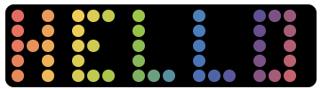
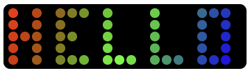
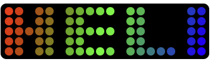
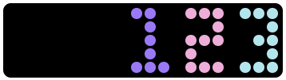
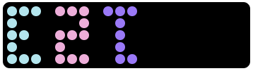
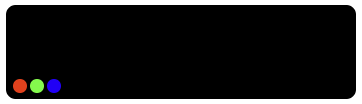

# Complete Service Reference

This document provides comprehensive documentation for all available services in the Yeelight Cube Lite Component for controlling Yeelight Cube Smart Lamp Lite devices.

> For a general overview of the integration, including installation, setup, cards and entities, see [README.md](README.md).

## 📋 Service Categories

### 🎨 **Text Services**

Display and control text on your Yeelight Cube Smart Lamp Lite

### 🖼️ **Drawing Services**

Create and manage pixel art on your device

### 🌈 **Gradient Services**

Control gradient effects and display modes

### 🎨 **Palette Services**

Manage color palettes

### ⚙️ **Configuration Services**

Device settings and properties

### 🔧 **Device Management**

Discovery and device management

---

## 🎨 Text Services

### `set_custom_text`

**Display text on the lamp**

```yaml
service: yeelight_cube.set_custom_text
data:
  text: "HELLO"
  entity_id: light.cubelite_192_168_4_102
```

<table>
  <tr>
    <td></td>
  </tr>
</table>

### `set_text_colors`

**Apply colors to the lamp**

```yaml
service: yeelight_cube.set_text_colors
data:
  text_colors: [[255, 0, 0], [0, 255, 0], [0, 0, 255]]
  entity_id: light.cubelite_192_168_4_102
```

<table>
  <tr>
    <td></td>
  </tr>
</table>

### `set_font`

**Change text font**

```yaml
service: yeelight_cube.set_font
data:
  font: "fat" # basic, fat, italic
  entity_id: light.cubelite_192_168_4_102
```

<table>
  <tr>
    <td></td>
  </tr>
</table>

### `set_alignment`

**Set text alignment**

```yaml
service: yeelight_cube.set_alignment
data:
  alignment: "right" # left, center, right
  entity_id: light.cubelite_192_168_4_102
```

<table>
  <tr>
    <td></td>
  </tr>
</table>

### `set_orientation`

**Control display orientation**

```yaml
service: yeelight_cube.set_orientation
data:
  orientation: "flipped" # normal, flipped
  entity_id: light.cubelite_192_168_4_102
```

<table>
  <tr>
    <td>
    <br />(lamp preview on dashboards will stay up-right, only the content displayed on the lamp will be rotated)</td>
  </tr>
</table>

---

## 🖼️ Drawing Services

### `apply_custom_pixels`

**Display a pixel art frame on the lamp. The lamp has 100 pixels arranged in a 20×5 grid (20 columns, 5 rows). Positions are numbered 0–99, left-to-right then bottom-to-top (position 0 = bottom-left, position 99 = top-right).**

**Each entry is an object with `position` (0–99) and `color` ([R, G, B]). Rules:**

- **You can send any number of entries** — you don't need to specify all 100 pixels.
- **Missing positions are treated as black** (off).
- **Entries can be in any order.**
- **If a position appears more than once, only the first entry is used.**
- **Positions outside 0–99 are ignored.**

```yaml
service: yeelight_cube.apply_custom_pixels
data:
  entity_id: light.cubelite_192_168_4_102
  pixels:
    [ { "position": 0, "color": [255, 0, 0] },
	{ "position": 1, "color": [0, 255, 0] },
	{ "position": 2, "color": [0, 0, 255] },
	{ "position": 3, "color": [0, 0, 0] },
	{ "position": 4, "color": [0, 0, 0] },
	{ "position": 5, "color": [0, 0, 0] },
	{ "position": 6, "color": [0, 0, 0] },
	{ "position": 7, "color": [0, 0, 0] },
	{ "position": 8, "color": [0, 0, 0] },
	{ "position": 9, "color": [0, 0, 0] },
	{ "position": 10, "color": [0, 0, 0] },
	{ "position": 11, "color": [0, 0, 0] },
	{ "position": 12, "color": [0, 0, 0] },
	{ "position": 13, "color": [0, 0, 0] },
	{ "position": 14, "color": [0, 0, 0] },
	{ "position": 15, "color": [0, 0, 0] },
	{ "position": 16, "color": [0, 0, 0] },
	{ "position": 17, "color": [0, 0, 0] },
	{ "position": 18, "color": [0, 0, 0] },
	{ "position": 19, "color": [0, 0, 0] },
	{ "position": 20, "color": [0, 0, 0] },
	{ "position": 21, "color": [0, 0, 0] },
	{ "position": 22, "color": [0, 0, 0] },
	{ "position": 23, "color": [0, 0, 0] },
	{ "position": 24, "color": [0, 0, 0] },
	{ "position": 25, "color": [0, 0, 0] },
	{ "position": 26, "color": [0, 0, 0] },
	{ "position": 27, "color": [0, 0, 0] },
	{ "position": 28, "color": [0, 0, 0] },
	{ "position": 29, "color": [0, 0, 0] },
	{ "position": 30, "color": [0, 0, 0] },
	{ "position": 31, "color": [0, 0, 0] },
	{ "position": 32, "color": [0, 0, 0] },
	{ "position": 33, "color": [0, 0, 0] },
	{ "position": 34, "color": [0, 0, 0] },
	{ "position": 35, "color": [0, 0, 0] },
	{ "position": 36, "color": [0, 0, 0] },
	{ "position": 37, "color": [0, 0, 0] },
	{ "position": 38, "color": [0, 0, 0] },
	{ "position": 39, "color": [0, 0, 0] },
	{ "position": 40, "color": [0, 0, 0] },
	{ "position": 41, "color": [0, 0, 0] },
	{ "position": 42, "color": [0, 0, 0] },
	{ "position": 43, "color": [0, 0, 0] },
	{ "position": 44, "color": [0, 0, 0] },
	{ "position": 45, "color": [0, 0, 0] },
	{ "position": 46, "color": [0, 0, 0] },
	{ "position": 47, "color": [0, 0, 0] },
	{ "position": 48, "color": [0, 0, 0] },
	{ "position": 49, "color": [0, 0, 0] },
	{ "position": 50, "color": [0, 0, 0] },
	{ "position": 51, "color": [0, 0, 0] },
	{ "position": 52, "color": [0, 0, 0] },
	{ "position": 53, "color": [0, 0, 0] },
	{ "position": 54, "color": [0, 0, 0] },
	{ "position": 55, "color": [0, 0, 0] },
	{ "position": 56, "color": [0, 0, 0] },
	{ "position": 57, "color": [0, 0, 0] },
	{ "position": 58, "color": [0, 0, 0] },
	{ "position": 59, "color": [0, 0, 0] },
	{ "position": 60, "color": [0, 0, 0] },
	{ "position": 61, "color": [0, 0, 0] },
	{ "position": 62, "color": [0, 0, 0] },
	{ "position": 63, "color": [0, 0, 0] },
	{ "position": 64, "color": [0, 0, 0] },
	{ "position": 65, "color": [0, 0, 0] },
	{ "position": 66, "color": [0, 0, 0] },
	{ "position": 67, "color": [0, 0, 0] },
	{ "position": 68, "color": [0, 0, 0] },
	{ "position": 69, "color": [0, 0, 0] },
	{ "position": 70, "color": [0, 0, 0] },
	{ "position": 71, "color": [0, 0, 0] },
	{ "position": 72, "color": [0, 0, 0] },
	{ "position": 73, "color": [0, 0, 0] },
	{ "position": 74, "color": [0, 0, 0] },
	{ "position": 75, "color": [0, 0, 0] },
	{ "position": 76, "color": [0, 0, 0] },
	{ "position": 77, "color": [0, 0, 0] },
	{ "position": 78, "color": [0, 0, 0] },
	{ "position": 79, "color": [0, 0, 0] },
	{ "position": 80, "color": [0, 0, 0] },
	{ "position": 81, "color": [0, 0, 0] },
	{ "position": 82, "color": [0, 0, 0] },
	{ "position": 83, "color": [0, 0, 0] },
	{ "position": 84, "color": [0, 0, 0] },
	{ "position": 85, "color": [0, 0, 0] },
	{ "position": 86, "color": [0, 0, 0] },
	{ "position": 87, "color": [0, 0, 0] },
	{ "position": 88, "color": [0, 0, 0] },
	{ "position": 89, "color": [0, 0, 0] },
	{ "position": 90, "color": [0, 0, 0] },
	{ "position": 91, "color": [0, 0, 0] },
	{ "position": 92, "color": [0, 0, 0] },
	{ "position": 93, "color": [0, 0, 0] },
	{ "position": 94, "color": [0, 0, 0] },
	{ "position": 95, "color": [0, 0, 0] },
	{ "position": 96, "color": [0, 0, 0] },
	{ "position": 97, "color": [0, 0, 0] },
	{ "position": 98, "color": [0, 0, 0] },
	{ "position": 99, "color": [0, 0, 0] }]
```

<table>
  <tr>
    <td>
  </tr>
</table>

### `save_pixel_art`

**Save current pixel configuration**

```yaml
service: yeelight_cube.save_pixel_art
data:
  pixels:
    - { "position": 0, "color": [255, 0, 0] }
    - { "position": 1, "color": [0, 255, 0] }
    # ... up to 100 entries (positions 0–99)
  name: "My Artwork"
  entity_id: light.cubelite_192_168_4_102
```

### `apply_pixel_art`

**Load saved pixel art by index**

```yaml
service: yeelight_cube.apply_pixel_art
data:
  idx: 0 # Index of saved pixel art
  entity_id: light.cubelite_192_168_4_102
```

### `remove_pixel_art`

**Delete saved pixel art**

```yaml
service: yeelight_cube.remove_pixel_art
data:
  idx: 0
  entity_id: light.cubelite_192_168_4_102
```

### `rename_pixel_art`

**Rename saved pixel art**

```yaml
service: yeelight_cube.rename_pixel_art
data:
  idx: 0
  new_name: "Updated Artwork"
  entity_id: light.cubelite_192_168_4_102
```

### `get_pixel_art`

**Retrieve saved pixel art data**

```yaml
service: yeelight_cube.get_pixel_art
data:
  idx: 0
  entity_id: light.cubelite_192_168_4_102
```

### `import_pixel_arts`

**Import a pixel art collection (replaces/merges saved pixel arts)**

```yaml
service: yeelight_cube.import_pixel_arts
data:
  pixel_arts: [{ "name": "Art1", "pixels": [[255, 0, 0], ...] }, ...]
  entity_id: light.cubelite_192_168_4_102
```

### `update_pixel_arts`

**Bulk-replace the entire saved pixel arts list**

```yaml
service: yeelight_cube.update_pixel_arts
data:
  pixel_arts: [{ "name": "Art1", "pixels": [[255, 0, 0], ...] }, ...]
  entity_id: light.cubelite_192_168_4_102
```

### `display_image`

**Display a base64-encoded image on the cube (resized/cropped to 20×5)**

```yaml
service: yeelight_cube.display_image
data:
  image_b64: "<base64-encoded image string>"
  entity_id: light.cubelite_192_168_4_102
```

---

## 🌈 Gradient Services

### `set_mode`

**Change display mode**

```yaml
service: yeelight_cube.set_mode
data:
  mode: "Angle Gradient" # See mode options below
  entity_id: light.cubelite_192_168_4_102
```

**Available Modes:**

- `Solid Color` - Single color fill
- `Letter Gradient` - Gradient per letter
- `Column Gradient` - Vertical gradient across 20 columns
- `Row Gradient` - Horizontal gradient across 5 rows
- `Angle Gradient` - Gradient at a configurable angle
- `Radial Gradient` - Circular gradient from center
- `Letter Vertical Gradient` - Vertical gradient applied per character
- `Letter Angle Gradient` - Angled gradient applied per character
- `Text Color Sequence` - Each character gets a different color from the sequence
- `Panel Color Sequence` - Color sequence applied across all pixels
- `Custom Draw` - Pixel art mode (use the Draw Card)

### `set_solid_color`

**Set a single solid RGB color on the lamp (shortcut for Solid Color mode)**

```yaml
service: yeelight_cube.set_solid_color
data:
  rgb_color: [255, 128, 0]
  entity_id: light.cubelite_192_168_4_102
```

### `set_angle`

**Set gradient angle (for Angle Gradient mode)**

```yaml
service: yeelight_cube.set_angle
data:
  angle: 45.0 # 0-360 degrees
  entity_id: light.cubelite_192_168_4_102
```

### `set_panel_mode`

**Control gradient coverage area**

```yaml
service: yeelight_cube.set_panel_mode
data:
  panel_mode: true # true = whole panel, false = text only
  entity_id: light.cubelite_192_168_4_102
```

### `preview_gradient_modes`

**Cycle through all gradient modes sequentially for a visual preview**

```yaml
service: yeelight_cube.preview_gradient_modes
data:
  entity_id: light.cubelite_192_168_4_102
```

---

## 🎨 Palette Services

### `save_palette`

**Save a color palette**

```yaml
service: yeelight_cube.save_palette
data:
  palette: [[255, 0, 0], [0, 255, 0], [0, 0, 255]]
  name: "RGB Rainbow"
  entity_id: light.cubelite_192_168_4_102
```

### `load_palette`

**Load saved palette by index**

```yaml
service: yeelight_cube.load_palette
data:
  idx: 0
  entity_id: light.cubelite_192_168_4_102
```

### `remove_palette`

**Delete saved palette**

```yaml
service: yeelight_cube.remove_palette
data:
  idx: 0
  entity_id: light.cubelite_192_168_4_102
```

### `rename_palette`

**Rename saved palette**

```yaml
service: yeelight_cube.rename_palette
data:
  idx: 0
  new_name: "Updated Palette"
  entity_id: light.cubelite_192_168_4_102
```

### `set_palettes`

**Set complete palette collection**

```yaml
service: yeelight_cube.set_palettes
data:
  palettes: [{ "name": "Palette1", "colors": [[255, 0, 0], [0, 255, 0]] }, ...]
  entity_id: light.cubelite_192_168_4_102
```

---

## ⚙️ Configuration Services

### `set_brightness`

**Set lamp brightness as a percentage**

```yaml
service: yeelight_cube.set_brightness
data:
  brightness: 75 # 1-100%
  entity_id: light.cubelite_192_168_4_102
```

### `set_preview_adjustments`

**Apply real-time color effects to the lamp output**

```yaml
service: yeelight_cube.set_preview_adjustments
data:
  hue_shift: 0 # -180 to +180 (color wheel rotation)
  temperature: 0 # -100 to +100 (cool/warm)
  saturation: 100 # 0-200 (color richness)
  vibrance: 100 # 0-200 (smart saturation)
  contrast: 100 # 0-200
  glow: 0 # 0-100 (bloom on highlights)
  grayscale: 0 # 0-100
  invert: 0 # 0-100
  tint_hue: 0 # 0-360 (color for tint overlay)
  tint_strength: 0 # 0-100
  entity_id: light.cubelite_192_168_4_102
```

### `set_color_accuracy`

**Toggle hardware colour accuracy correction (per-channel gain)**

```yaml
service: yeelight_cube.set_color_accuracy
data:
  enabled: true
  entity_id: light.cubelite_192_168_4_102
```

### `set_color_calibration`

**Adjust colour correction calibration values at runtime (debug/advanced)**

All fields are optional — only provided values are updated. Changes are not persisted across restarts.

```yaml
service: yeelight_cube.set_color_calibration
data:
  gamma_r: 0.85
  gamma_g: 0.75
  gamma_b: 0.65
  gain_r: 1.00
  gain_g: 0.87
  gain_b: 0.72
  entity_id: light.cubelite_192_168_4_102
```

---

## 🔧 Device Management

### `add_managed_device`

**Add device to managed list**

```yaml
service: yeelight_cube.add_managed_device
data:
  ip_address: "192.168.1.100"
```

### `remove_managed_device`

**Remove device from managed list**

```yaml
service: yeelight_cube.remove_managed_device
data:
  ip_address: "192.168.1.100"
```

### `is_device_managed`

**Check if device is managed**

```yaml
service: yeelight_cube.is_device_managed
data:
  ip_address: "192.168.1.100"
```

### `list_managed_devices`

**List all managed devices**

```yaml
service: yeelight_cube.list_managed_devices
```

### `test_device_detection`

**Test device detection logic**

```yaml
service: yeelight_cube.test_device_detection
data:
  device_model: "cubelite"
  device_name: "Yeelight Cube Lite"
  device_id: "0x12345678"
```

### `ignore_yeelight_discovery`

**Ignore IP in Yeelight integration**

```yaml
service: yeelight_cube.ignore_yeelight_discovery
data:
  ip_address: "192.168.4.139"
```

### `ignore_specific_yeelight`

**Ignore specific device in Yeelight integration**

```yaml
service: yeelight_cube.ignore_specific_yeelight
data:
  ip_address: "192.168.4.139"
```

### `force_rediscovery`

**Force device rediscovery**

```yaml
service: yeelight_cube.force_rediscovery
data:
  ip_address: "192.168.4.139"
```

### `trigger_manual_discovery`

**Manually trigger discovery**

```yaml
service: yeelight_cube.trigger_manual_discovery
data:
  ip_address: "192.168.4.139"
  device_name: "CubeLite Test"
  device_model: "cubelite"
  device_id: "0x12345678"
```

### `create_cube_discovery`

**Create discovery flow for cube**

```yaml
service: yeelight_cube.create_cube_discovery
data:
  ip_address: "192.168.4.139"
  device_name: "My CubeLite"
```

### `test_display`

**Test cube connectivity and display**

```yaml
service: yeelight_cube.test_display
data:
  entity_id: light.cubelite_192_168_4_102
```

---

## 🎯 Multi-Entity Operations

All services support multi-entity operations. You can target multiple cubes by calling the same service multiple times with different `entity_id` values, or use automations to synchronize operations.

### Example: Synchronized Text Display

```yaml
# Show same text on all cubes
- service: yeelight_cube.set_custom_text
  data:
    text: "SYNC"
    entity_id: light.cubelite_192_168_4_102
- service: yeelight_cube.set_custom_text
  data:
    text: "SYNC"
    entity_id: light.cubelite_192_168_4_247
```

### Example: Different Content Per Cube

```yaml
# Show different content on each cube
- service: yeelight_cube.set_custom_text
  data:
    text: "CUBE 1"
    entity_id: light.cubelite_192_168_4_102
- service: yeelight_cube.set_custom_text
  data:
    text: "CUBE 2"
    entity_id: light.cubelite_192_168_4_247
```

---

## 📱 Node-RED Integration

All services are fully compatible with Node-RED and provide:

- **Parameter descriptions** and examples
- **Entity selectors** for device targeting
- **Input validation** and type checking
- **Dropdown menus** for mode selection
- **Sliders** for numeric values

### Example Node-RED Flow

```json
[
  {
    "id": "cube_text",
    "type": "api-call-service",
    "name": "Set Cube Text",
    "server": "home_assistant",
    "service_domain": "yeelight_cube",
    "service": "set_custom_text",
    "data": {
      "text": "{{payload.message}}",
      "entity_id": "light.cubelite_192_168_4_102"
    }
  }
]
```

---

## 🔍 Service Response Data

Some services return data that can be used in automations:

### `list_managed_devices`

Returns: List of managed IP addresses

### `get_pixel_art`

Returns: Pixel art data including name and pixel array

### `test_device_detection`

Returns: Boolean indicating if device would be detected

### `is_device_managed`

Returns: Boolean indicating if device is managed

---

## ⚡ Quick Reference

| Category          | Primary Services                                             | Purpose                     |
| ----------------- | ------------------------------------------------------------ | --------------------------- |
| **Text**          | `set_custom_text`, `set_text_colors`                         | Display text with colors    |
| **Drawing**       | `apply_custom_pixels`, `save_pixel_art`, `apply_pixel_art`   | Create and manage pixel art |
| **Gradients**     | `set_mode`, `set_solid_color`, `set_angle`, `set_panel_mode` | Control display modes       |
| **Palettes**      | `save_palette`, `load_palette`, `set_palettes`               | Manage color collections    |
| **Text Settings** | `set_font`, `set_alignment`, `set_orientation`               | Text formatting             |
| **Color Effects** | `set_preview_adjustments`, `set_color_accuracy`              | Real-time color adjustments |
| **Management**    | `create_cube_discovery`, `test_display`, `force_refresh`     | Device setup & diagnostics  |

---

_For more examples and advanced usage, see the main [README.md](README.md)_
